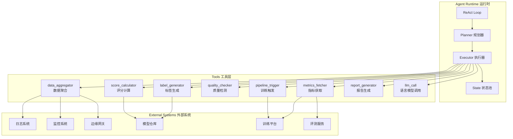
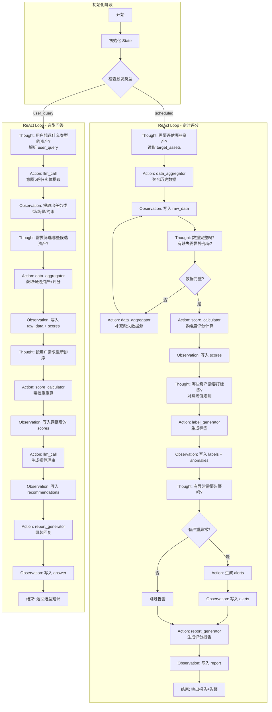
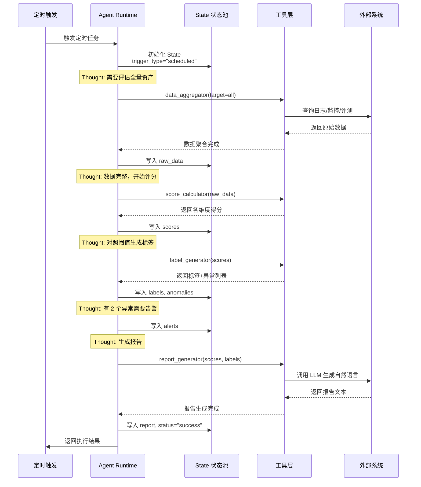
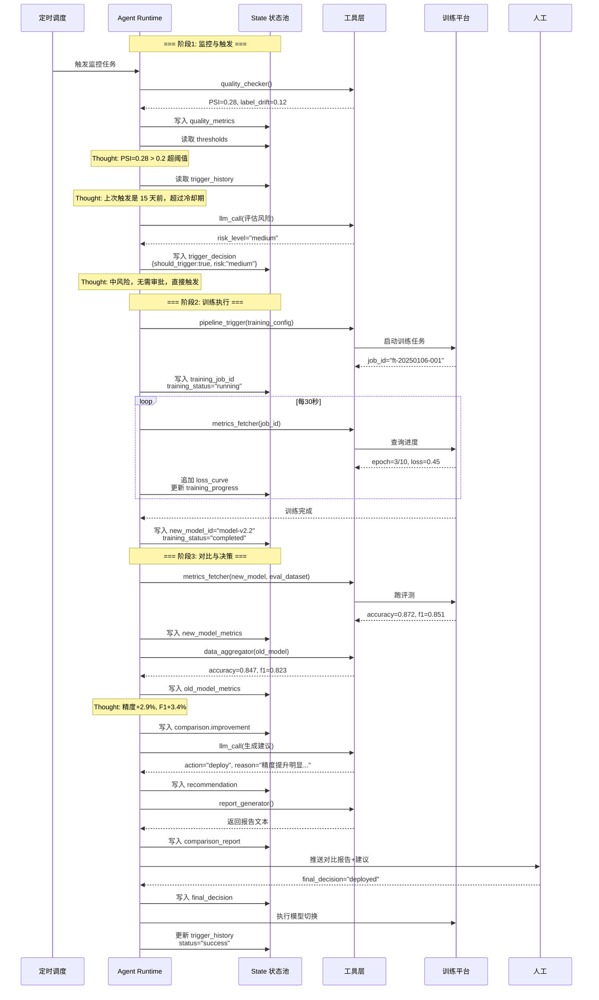
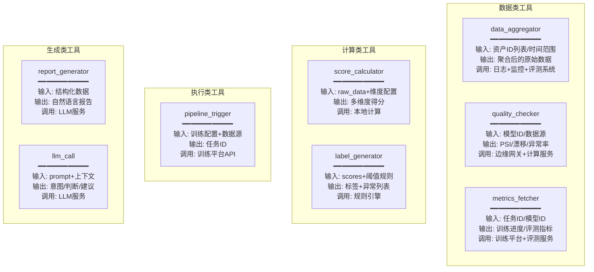
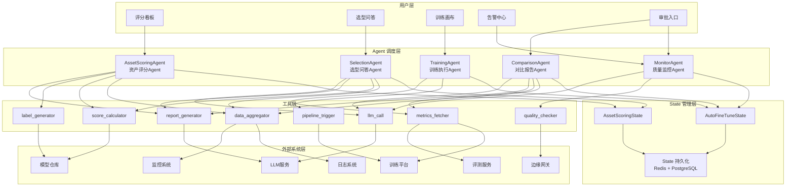

# Agent 资源管理与自动微调系统设计

> 本文档包含两个场景的完整 Agent 系统设计：资产评分与选型、自动微调触发。
> 包括 State 设计、ReAct 流程、工具定义、时序图等底层架构细节。

---

## 一、整体架构：两个场景共用的 Agent 底座



---

## 二、场景 A：资产评分 Agent 完整设计

### 2.1 State 状态结构定义

```
┌─────────────────────────────────────────────────────────────────────────────┐
│                         AssetScoringState 资产评分状态                        │
├─────────────────────────────────────────────────────────────────────────────┤
│ 【输入区 - 只读】                                                             │
│  ├─ trigger_type: string          // 触发类型："scheduled" | "user_query"    │
│  ├─ user_query: string | null     // 用户问题（如果是问答触发）                │
│  ├─ target_assets: list | null    // 指定评估的资产列表，null=全量             │
│  └─ eval_dimensions: list         // 评估维度配置（从系统配置读取）            │
├─────────────────────────────────────────────────────────────────────────────┤
│ 【过程区 - 可读写】                                                           │
│  ├─ current_step: string          // 当前步骤标识                            │
│  ├─ raw_data: dict                // 聚合后的原始数据                         │
│  │   ├─ inference_logs: list      //   推理日志                              │
│  │   ├─ resource_metrics: list    //   资源监控数据                          │
│  │   ├─ eval_results: list        //   历史评测结果                          │
│  │   └─ user_feedback: list       //   用户反馈记录                          │
│  ├─ scores: dict                  // 各资产各维度得分                         │
│  │   └─ {asset_id: {dimension: score}}                                      │
│  ├─ labels: dict                  // 各资产标签                              │
│  │   └─ {asset_id: [label1, label2]}                                        │
│  ├─ anomalies: list               // 检测到的异常                            │
│  ├─ recommendations: list         // 生成的推荐（用于选型问答）                │
│  └─ iteration_count: int          // ReAct 循环次数（用于防死循环）            │
├─────────────────────────────────────────────────────────────────────────────┤
│ 【输出区 - 最终写入】                                                         │
│  ├─ report: string                // 生成的自然语言报告                       │
│  ├─ alerts: list                  // 需要推送的告警                           │
│  ├─ answer: string | null         // 问答场景的回复                           │
│  └─ status: string                // 执行状态："success" | "error" | "pending"│
└─────────────────────────────────────────────────────────────────────────────┘
```

---

### 2.2 ReAct 完整流程图



---

### 2.3 每个 Action 的详细定义

| Action 名称 | 输入（从 State 读） | 输出（写入 State） | 调用的外部系统 | 失败处理 |
|------------|-------------------|-------------------|---------------|---------|
| `data_aggregator` | `target_assets`, `eval_dimensions` | `raw_data.inference_logs`, `raw_data.resource_metrics`, `raw_data.eval_results` | 日志系统、监控系统、评测服务 | 记录缺失字段，标记 `data_incomplete=true` |
| `score_calculator` | `raw_data`, `eval_dimensions` | `scores` | 无（本地计算） | 缺失维度填 null，不阻断流程 |
| `label_generator` | `scores`, 阈值配置 | `labels`, `anomalies` | 无（规则引擎） | 无法判断的资产标记 `unknown` |
| `report_generator` | `scores`, `labels`, `anomalies` | `report` | LLM 服务 | 降级为结构化文本输出 |
| `llm_call` | `user_query` 或其他上下文 | 视具体用途 | LLM 服务 | 重试 1 次，仍失败则返回预设回复 |

---

### 2.4 State 流转示意（定时评分场景）



---

## 三、场景 B：自动微调 Agent 完整设计

### 3.1 State 状态结构定义

```
┌─────────────────────────────────────────────────────────────────────────────┐
│                      AutoFineTuneState 自动微调状态                          │
├─────────────────────────────────────────────────────────────────────────────┤
│ 【输入区 - 只读】                                                             │
│  ├─ monitor_config: dict          // 监控配置                                │
│  │   ├─ target_model: string      //   监控的目标模型                         │
│  │   ├─ thresholds: dict          //   各指标阈值                            │
│  │   └─ cooldown_days: int        //   冷却期天数                            │
│  ├─ training_config: dict         // 训练配置模板                            │
│  │   ├─ base_model: string        //   基座模型                              │
│  │   ├─ default_params: dict      //   默认超参                              │
│  │   └─ eval_dataset: string      //   评测数据集                            │
│  └─ approval_required: bool       // 是否需要人工审批                         │
├─────────────────────────────────────────────────────────────────────────────┤
│ 【监控区 - 持续更新】                                                         │
│  ├─ current_step: string          // 当前步骤                                │
│  ├─ quality_metrics: dict         // 最新数据质量指标                         │
│  │   ├─ psi_score: float          //   PSI 数据漂移分数                       │
│  │   ├─ label_drift: float        //   标签分布漂移                          │
│  │   ├─ anomaly_rate: float       //   异常样本率                            │
│  │   └─ data_volume: int          //   数据量                                │
│  ├─ trigger_history: list         // 触发历史（用于判断冷却期）                │
│  ├─ trigger_decision: dict        // 触发决策                                │
│  │   ├─ should_trigger: bool      //   是否应该触发                          │
│  │   ├─ reason: string            //   触发/不触发原因                        │
│  │   └─ risk_level: string        //   风险等级 "low"|"medium"|"high"        │
│  └─ human_approval: string|null   // 人工审批结果 "approved"|"rejected"|null  │
├─────────────────────────────────────────────────────────────────────────────┤
│ 【训练区 - 训练过程中更新】                                                    │
│  ├─ training_status: string       // 训练状态 "not_started"|"running"|...    │
│  ├─ training_job_id: string|null  // 训练任务ID                              │
│  ├─ training_progress: dict       // 训练进度                                │
│  │   ├─ current_epoch: int        //   当前 epoch                            │
│  │   ├─ total_epochs: int         //   总 epoch                              │
│  │   └─ current_loss: float       //   当前 loss                             │
│  ├─ training_metrics: dict        // 训练指标历史                            │
│  │   ├─ loss_curve: list          //   loss 曲线数据点                        │
│  │   └─ eval_metrics: dict        //   评估指标                              │
│  └─ new_model_id: string|null     // 新模型ID                                │
├─────────────────────────────────────────────────────────────────────────────┤
│ 【对比区 - 训练完成后写入】                                                    │
│  ├─ comparison: dict              // 新旧模型对比                            │
│  │   ├─ old_model_metrics: dict   //   旧模型指标                            │
│  │   ├─ new_model_metrics: dict   //   新模型指标                            │
│  │   └─ improvement: dict         //   各维度提升/下降百分比                   │
│  ├─ recommendation: dict          // Agent 建议                              │
│  │   ├─ action: string            //   "deploy"|"observe"|"reject"           │
│  │   └─ reason: string            //   建议理由                              │
│  └─ comparison_report: string     // 自然语言对比报告                         │
├─────────────────────────────────────────────────────────────────────────────┤
│ 【输出区 - 最终状态】                                                         │
│  ├─ final_decision: string        // 最终决策 "deployed"|"rejected"|"pending" │
│  ├─ notifications: list           // 发出的通知列表                           │
│  └─ status: string                // 整体状态                                │
└─────────────────────────────────────────────────────────────────────────────┘
```

---

### 3.2 ReAct 完整流程图（分阶段）

#### 阶段 1：数据质量监控 + 触发判断

```mermaid
graph TD
    subgraph 监控循环
        M_START[监控启动] --> M_THINK1[Thought: 检查边缘数据质量]
        M_THINK1 --> M_ACT1[Action: quality_checker<br/>计算 PSI/漂移/异常率]
        M_ACT1 --> M_OBS1[Observation: 写入 quality_metrics]
        
        M_OBS1 --> M_THINK2[Thought: 对照阈值判断]
        M_THINK2 --> M_CHECK1{任一指标超阈值?}
        
        M_CHECK1 -->|否| M_WAIT[等待下一个监控周期]
        M_WAIT --> M_THINK1
        
        M_CHECK1 -->|是| M_THINK3[Thought: 检查冷却期]
        M_THINK3 --> M_ACT2[Action: 读取 trigger_history<br/>计算距上次触发天数]
        M_ACT2 --> M_OBS2[Observation: 获取冷却状态]
        
        M_OBS2 --> M_CHECK2{在冷却期内?}
        M_CHECK2 -->|是| M_SKIP[记录跳过原因<br/>写入 trigger_decision]
        M_SKIP --> M_WAIT
        
        M_CHECK2 -->|否| M_THINK4[Thought: 评估风险等级]
        M_THINK4 --> M_ACT3[Action: llm_call<br/>综合判断风险]
        M_ACT3 --> M_OBS3[Observation: 写入 trigger_decision]
        
        M_OBS3 --> M_CHECK3{风险等级?}
        M_CHECK3 -->|high| M_NOTIFY[通知人工审批<br/>写入 notifications]
        M_CHECK3 -->|low/medium| M_TRIGGER[进入训练阶段]
        
        M_NOTIFY --> M_WAIT_APPROVAL[等待 human_approval]
        M_WAIT_APPROVAL --> M_CHECK4{审批结果?}
        M_CHECK4 -->|approved| M_TRIGGER
        M_CHECK4 -->|rejected| M_REJECT[记录拒绝<br/>更新 trigger_history]
        M_REJECT --> M_WAIT
    end
```



#### 阶段 2：训练执行 + 实时监控

```mermaid
graph TD
    subgraph 训练执行
        T_START[触发训练] --> T_THINK1[Thought: 准备训练参数]
        T_THINK1 --> T_ACT1[Action: 读取 training_config<br/>+ 边缘数据统计]
        T_ACT1 --> T_OBS1[Observation: 确定训练参数]
        
        T_OBS1 --> T_ACT2[Action: pipeline_trigger<br/>启动训练 Pipeline]
        T_ACT2 --> T_OBS2[Observation: 获取 training_job_id<br/>写入 training_status="running"]
        
        T_OBS2 --> T_LOOP[进入监控循环]
    end
    
    subgraph 训练监控循环
        T_LOOP --> T_THINK2[Thought: 检查训练进度]
        T_THINK2 --> T_ACT3[Action: metrics_fetcher<br/>获取当前 loss/epoch]
        T_ACT3 --> T_OBS3[Observation: 写入 training_progress<br/>追加 loss_curve]
        
        T_OBS3 --> T_CHECK1{训练完成?}
        T_CHECK1 -->|否| T_THINK3[Thought: 有异常吗?]
        T_THINK3 --> T_CHECK2{loss 异常/超时?}
        T_CHECK2 -->|是| T_ALERT[发送告警<br/>写入 notifications]
        T_CHECK2 -->|否| T_SLEEP[等待 30 秒]
        T_ALERT --> T_SLEEP
        T_SLEEP --> T_THINK2
        
        T_CHECK1 -->|是| T_FINISH[训练完成<br/>写入 new_model_id]
    end
```

#### 阶段 3：模型对比 + 建议生成

```mermaid
graph TD
    subgraph 模型对比
        C_START[对比启动] --> C_THINK1[Thought: 获取新旧模型指标]
        C_THINK1 --> C_ACT1[Action: metrics_fetcher<br/>跑评测集]
        C_ACT1 --> C_OBS1[Observation: 写入 new_model_metrics]
        
        C_OBS1 --> C_ACT2[Action: data_aggregator<br/>获取旧模型历史指标]
        C_ACT2 --> C_OBS2[Observation: 写入 old_model_metrics]
        
        C_OBS2 --> C_THINK2[Thought: 计算各维度变化]
        C_THINK2 --> C_ACT3[Action: 本地计算<br/>improvement 百分比]
        C_ACT3 --> C_OBS3[Observation: 写入 comparison.improvement]
        
        C_OBS3 --> C_THINK3[Thought: 综合判断是否推荐上线]
        C_THINK3 --> C_ACT4[Action: llm_call<br/>生成建议+理由]
        C_ACT4 --> C_OBS4[Observation: 写入 recommendation]
        
        C_OBS4 --> C_ACT5[Action: report_generator<br/>生成对比报告]
        C_ACT5 --> C_OBS5[Observation: 写入 comparison_report]
        
        C_OBS5 --> C_NOTIFY[通知相关人员<br/>写入 notifications]
        C_NOTIFY --> C_WAIT[等待人工决策]
        
        C_WAIT --> C_CHECK{final_decision?}
        C_CHECK -->|deployed| C_DEPLOY[执行模型切换]
        C_CHECK -->|rejected| C_ARCHIVE[归档新模型<br/>不上线]
        
        C_DEPLOY --> C_END[更新 trigger_history<br/>状态归位]
        C_ARCHIVE --> C_END
    end
```



---

### 3.3 完整 State 流转时序图



---

### 3.4 每个 Action 的详细定义

| Action 名称 | 输入（从 State 读） | 输出（写入 State） | 调用的外部系统 | 失败处理 |
|------------|-------------------|-------------------|---------------|---------|
| `quality_checker` | `monitor_config.target_model` | `quality_metrics` | 边缘网关、日志系统 | 记录检测失败，下次重试 |
| `pipeline_trigger` | `training_config`, `quality_metrics` | `training_job_id`, `training_status` | 训练平台 | 重试 2 次，仍失败则告警+退出 |
| `metrics_fetcher` | `training_job_id` 或 `model_id` | `training_progress` 或 `*_model_metrics` | 训练平台、评测服务 | 等待重试，超时告警 |
| `report_generator` | `comparison`, `recommendation` | `comparison_report` | LLM 服务 | 降级为结构化文本 |
| `llm_call` | 上下文信息 | `trigger_decision.risk_level` 或 `recommendation` | LLM 服务 | 降级为规则判断 |

---

## 四、两个场景的工具层统一定义



---

## 五、给研发的接口设计建议

### 5.1 State 持久化方案

| 存储类型 | 适用场景 | 建议方案 |
|---------|---------|---------|
| **短期状态** | 单次任务执行过程中的中间结果 | 内存（Redis） |
| **长期状态** | trigger_history、历史报告 | 数据库（PostgreSQL） |
| **实时指标** | loss_curve、training_progress | 时序数据库（InfluxDB）或直接写日志 |

### 5.2 ReAct 循环的工程实现要点

```
┌─────────────────────────────────────────────────────────────┐
│                     ReAct 循环控制器                         │
├─────────────────────────────────────────────────────────────┤
│ max_iterations: 20          // 最大循环次数，防死循环          │
│ timeout_seconds: 3600       // 单次任务超时                   │
│ retry_policy:               // 重试策略                      │
│   - action_retry: 2         //   单个 action 重试次数         │
│   - backoff: exponential    //   指数退避                    │
│ checkpoint_interval: 5      // 每 5 步存一次 checkpoint        │
│ rollback_enabled: true      // 支持回滚到 checkpoint          │
└─────────────────────────────────────────────────────────────┘
```

### 5.3 人机交互点设计

| 交互点 | 触发条件 | 交互方式 | 超时处理 |
|-------|---------|---------|---------|
| 高风险微调审批 | `risk_level="high"` | 消息推送 + 确认按钮 | 48h 无响应自动拒绝 |
| 模型上线决策 | 训练完成后 | 对比报告 + 决策按钮 | 72h 无响应自动归档 |
| 异常告警确认 | loss 异常/训练失败 | 消息推送 | 无需确认，仅通知 |

---

## 六、总结一张完整架构图



---

## 七、核心设计要点总结

1. **State 是整个系统的"档案柜"**：所有中间状态都往里写，Agent 每一步都从里面读
2. **ReAct 是"思考-行动-观察"的循环**：每一步都有明确的输入输出，方便调试和追踪
3. **工具层是"手和脚"**：Agent 不直接访问外部系统，全靠工具层代理
4. **人机交互点要显式设计**：哪些地方需要人确认、超时怎么处理，都要提前定好
