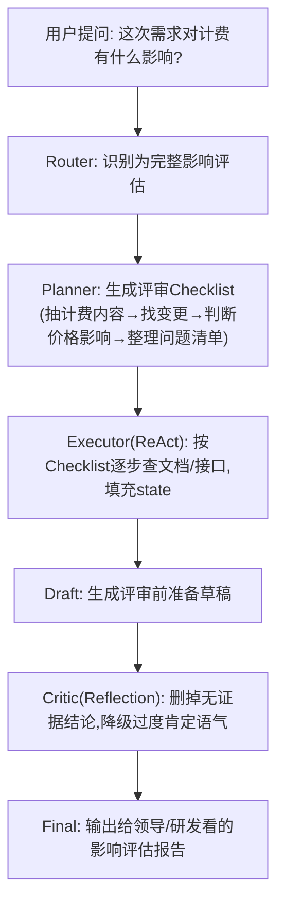

# Agent-Study

> 个人用的 Agentic Patterns（智能体编排模式）学习仓库。
>
> 目标：把自己从“用 ChatGPT/Manus 写写文案”的状态，拉到能**用 Agent 思维设计流程和工具**的程度。

---

## 🌟 项目简介 (What is Agent-Study?)

- **定位**：这是一个纯自用的「学习操场」，不是开源教程，也不是成品框架。
- **学习主题**：围绕高级 Agent 模式，例如：
  - **ReAct**（Reason + Act，思考-行动循环）
  - **Planner**（Plan-and-Solve，先规划再执行）
  - **Reflection / Critic**（自我审查 / Reviewer）
  - **State Graph**（状态图，把整个任务的 state 管起来）
- **使用方式**：
  - 每次学习都配合一个 AI 助手（Qoder）对话；
  - 所有重要对话会被整理成 Markdown 笔记和 Mermaid 流程图；
  - 用 Git 做「学习版本控制」，方便以后回看自己的理解演化。

---

## 📁 仓库结构 (Repository Structure)

```bash
.
├── sessions/             # 每日学习流水 & 流程图归档
│   ├── 2025-12-16.md
│   ├── 2025-12-17.md
│   └── 2025-12-18.md
├── progress/
│   └── study-tracker.md  # 全局学习进度 & 知识盲区仪表盘
└── RULES.md              # Qoder 的「使用说明书」和学习协议
```

- **`sessions/YYYY-MM-DD.md`**
  - 记录当天的：
    - 会话概览（日期、时长、主题）
    - 逐个知识点的「我的初始理解 → Qoder 解释 → 理解检查」
    - 当天产生的 Mermaid 流程图
    - 当天新暴露的知识盲区 & 已掌握主题
- **`progress/study-tracker.md`**
  - 作为「单一真相来源」记录：
    - 整体知识体系（A-E 五大模块）覆盖进度
    - 已掌握的 Pattern 列表（带日期 & 核心见解）
    - 当前未解决的知识盲区
- **`RULES.md`**
  - 约定 Qoder 的角色、教学方法（苏格拉底式）、
  - 记录会话/更新进度的规范，
  - 以及 Git 同步策略（何时必须 commit & push）。

---

## 🎯 学习地图 (Syllabus Overview)

学习重点按照 RULES 里的权重设计，当前顺序：

1. **B. 核心编排模式 (Core Patterns)** – 先学走路
   - B.1 ReAct（循环 / Thought-Action-Observation）
   - B.2 Planner（Plan-and-Solve，任务拆解 & 流程图）
   - B.3 Reflection / Self-Correction（自我审查、Critic）
   - B.4 Tool Use / Function Calling（工具定义 & 容错）
2. **D. 记忆与状态管理 (Memory & State)** – 再学记事
3. **C. 多智能体架构 (Multi-Agent)** – 最后组队
4. **A. 基础认知 (Foundations)** – 查漏补缺
5. **E. 评估与工程化 (Ops & Eval)** – 实战优化

当前进度可以在 `progress/study-tracker.md` 的「领域进度摘要」中看到。

---

## 🧠 示例：需求评审助手的 Agent 流程

下面是一段在本仓库里沉淀下来的典型流程图，用来练习 Router / Planner / ReAct / Critic 的组合：



这个流程图主要是给「未来的自己」看的：
- 提醒自己 ReAct 不只是“循环查资料”，而是和 Planner/Reflection 一起工作；
- 提醒自己在对外输出（尤其是给领导/研发看）时，一定要有 Critic 这道安全阀。

---

## 🔧 日常使用小笔记 (For Future Me)

- 开始新一天学习前：
  - 在本地仓库目录执行 `git pull`，确保拿到最新的 `RULES.md` 和笔记。
- 每次和 Qoder 完成一轮高密度学习后：
  1. 在 `sessions/` 里补当天的会话记录 + 流程图；
  2. 更新 `progress/study-tracker.md` 里的进度、盲区和已掌握主题；
  3. 执行：
     - `git add -A`
     - `git commit -m "docs: 更新学习记录"`
     - `git push`
- 记住：这个仓库不是给别人看的作品集，而是**你自己的 Agent 思维训练营**，可以大胆记录自己的误解、纠结和思路变化。
