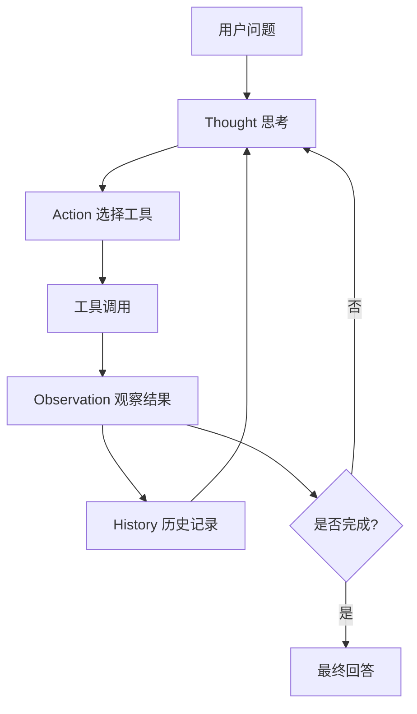
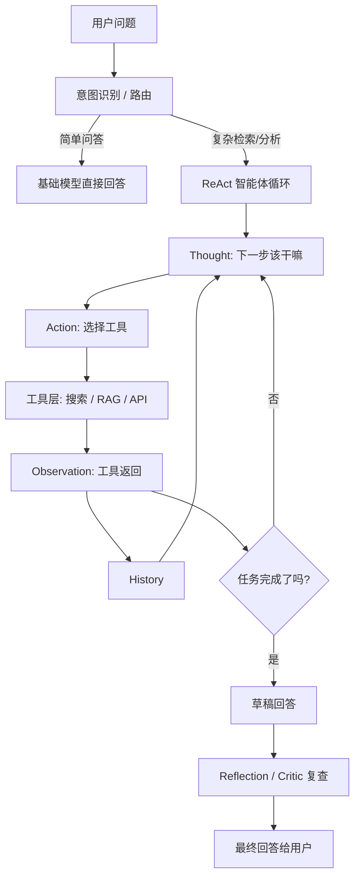
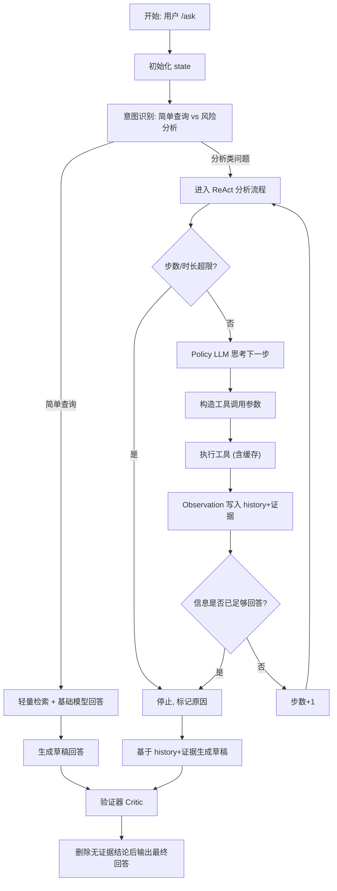

# 学习笔记 - 2025-12-17

## 1. 会话概览 (Session Overview)

- 日期: 2025-12-17
- 时长: ~60-90 分钟
- 主要主题:
  - B.1 ReAct (Reason+Act) 核心循环
  - ReAct vs Planner vs Reflection 的分工
  - 基于 RAG 的需求文档助手架构 (Router + ReAct + Critic)

---

## 2. 核心交互记录 (Interaction Log)

> 针对每一个讨论的知识点,按模板记录: 我的初始误解 → 你的解释 → 理解检查。

### 主题 1: ReAct Loop & 高开销模式定位

- 我的问题/场景 (My Question/Scenario):
  - 以为 ReAct 是某个“前端项目名”,对模式本身没概念; 对 RAG 的实践经验主要来自 NotebookLM / Copilot 这种现成产品。

- 我的初始理解 (My Initial Understanding):
  - [ ] 没有意识到 Thought-Action-Observation 是一个循环结构,更像“死循环”或黑盒推理。
  - [x] 初步能想到:复杂任务可能需要“先查再决定下一步”,但没形成架构语言。

- 提供的解释 (Explanation Given):
  - ReAct = Reason + Act, 本质是给 LLM 安上一个 while 循环: 每一步先 Thought(思考) 再 Action(调用工具),得到 Observation 后写入 history,再进入下一轮。
  - history/短期记忆不是装饰,而是为了复用之前的尝试结果,避免每一步都像“第一次见到问题”。
  - ReAct 应该定位成“为困难任务准备的高开销模式”,前面通常会加一层 Router/意图识别,简单问题走单轮回答以节省 token 和延迟。

- 理解检查 (Comprehension Checks):
  - 问题(Q): 工具返回空/垃圾结果时,合理的下一步是什么?
  - 我的回答: 让 LLM 在 Thought 里反思 query/工具是否合适,必要时改写 query 或换工具,而不是直接崩溃或胡编。
  - 标记: ✓ 正确
  - 洞察: 明确把“失败”也纳入循环,不是只为成功路径设计流程。
  - 理解程度: 良好

---

### 主题 2: 死循环防护 & 成本控制

- 我的问题/场景 (My Question/Scenario):
  - 现实里 ReAct 可能反复查同一类信息或者在两个工具间来回跳; 工具调用也可能很贵(第三方计费 API)。

- 我的初始理解 (My Initial Understanding):
  - [x] 直觉上需要“步数/时长上限”,但没系统想过需要在 state 中显式记录停止原因。
  - [ ] 过度依赖 LLM 自觉“记得别再调贵工具”。

- 提供的解释 (Explanation Given):
  - Loop Controller 负责: 步数上限、时间上限、缓存策略、stop_reason 记录(完成/超限/错误)。
  - 对贵工具采用 Tool/Controller 层缓存,用 (tool_name, params) 作为 key,命中则直接返回旧 Observation,不用完全依赖 LLM 的“记忆力”。

- 理解检查 (Comprehension Checks):
  - 问题(Q): 如果只看最新 Observation,不看完整 history,会有什么问题?
  - 我的回答: 多步任务会“失忆”,无法复用前几步的尝试,导致重复搜索、成本上升,甚至逻辑不连贯。
  - 标记: ✓ 正确
  - 洞察: history 是决策上下文,不是日志; ReAct 的“智能”来自对整条轨迹的利用。
  - 理解程度: 良好

---

### 主题 3: ReAct vs Planner vs Reflection 的分工

- 我的问题/场景 (My Question/Scenario):
  - 什么时候应该用 Planner(先规划后执行),什么时候用 ReAct(边查边想),Reflection 又该放在什么位置?

- 我的初始理解 (My Initial Understanding):
  - [x] 能直觉判断“30 页方案拆成四个部分摘要”适合 Planner,但没形成统一决策规则。
  - [ ] 没有明确把 Reflection 抽象成“验货层”,更多停留在“润色一下回答”的印象。

- 提供的解释 (Explanation Given):
  - ReAct: 外部环境不确定、要探索式调查时适用,边查边决定下一步。
  - Planner: 任务结构清晰时(如固定几步流水线),先列步骤再按步骤调用工具,能减少回合数。
  - Reflection/Critic: 在给用户之前做一层“验货”: 检查是否答题、有无证据支撑、是否乱承诺,必要时删掉无证据的句子或调整说法更审慎。

- 理解检查 (Comprehension Checks):
  - 问题(Q): 如果一个对外/对大领导的回答存在两个结论找不到文档支撑,应该怎么处理?
  - 我的回答: 直接删掉这两句或改成更审慎的表述,不要把“猜测”当成结论给出去。
  - 标记: ✓ 正确
  - 洞察: 自己的产品定位偏“审慎型助手”,宁缺毋滥,更重视忠诚度而不是“看起来很聪明”。
  - 理解程度: 良好

---

### 主题 4: 基于 RAG 的需求文档助手架构

- 我的问题/场景 (My Question/Scenario):
  - 希望有一个“需求文档助手”,能回答类似“这版需求对计费系统有什么影响?”,并且要有文档证据、不要乱承诺。

- 我的初始理解 (My Initial Understanding):
  - [x] 直觉上需要查 PRD/Jira 等,但对 Router/Tools/Critic 的职责划分还不清楚。
  - [ ] 对 state 作为统一上下文容器的概念还不牢,更像“每个子模块各管一摊”。

- 提供的解释 (Explanation Given):
  - 用统一 state 承载: 用户问题、意图类型、步数计数、ReAct history、检索文档列表、草稿回答、验证结果、停止原因 等。
  - 在此之上构建 State Graph 节点: Router → ReAct → Draft Answer → Critic → Final Answer。
  - 工具层围绕需求域: `search_prd_docs`, `get_requirement_history`, `diff_requirements`, `search_related_components` 等。

- 理解检查 (Comprehension Checks):
  - 问题(Q): 如果 Router 误把复杂分析问题当成简单问答,会有什么风险? 如何兜底?
  - 我的回答: 风险是答案既不深也没证据,容易幻觉; 可以在简单路径的回答阶段加自检,发现缺乏依据时“升级”到 ReAct 流程,或者提示用户问题过大需拆分。
  - 标记: ✓ 大体正确
  - 洞察: 意图识别不是单点决策,可以配合回答阶段的“自觉升级”机制来降低误判风险。
  - 理解程度: 良好

---

## 3. 🗺️ 流程图存档 (Diagram Archive)

### 图表 1: 通用 ReAct 执行流程

### 图表 2: RAG + 意图识别 + ReAct + Reflection 总体架构

### 图表 3: 需求文档助手 /ask 完整流程

---

## 4. 识别出的知识盲区 (Knowledge Gaps Identified)

> 使用表格形式列出今天暴露出来的 Gap, 与 progress/study-tracker.md 保持一致。

主题 | 严重程度 | 备注
--- | --- | ---
LangGraph State Graph/节点建模 | 中 | 还没在具体框架中实现, 不清楚各节点的接口形式与持久化策略
ReAct+Critic 落地到 Jira/需求平台 | 中 | 仅停留在概念架构, 未考虑真实系统的权限、超时和错误重试设计

---

## 5. 今日掌握的主题 (Topics Mastered Today)

主题 | 信心指数 | 备注
--- | --- | ---
ReAct 工作流 | 高 | 能用 ReAct Loop 语言描述 Thought-Action-Observation 闭环, 并意识到其“高开销模式”定位
ReAct vs Planner vs Reflection 的边界 | 良好 | 能根据任务结构和风险要求, 选择 Planner/ReAct/Reflection 的组合
需求文档助手的整体架构 | 良好 | 已经能画出 Router → ReAct → Critic 的数据流, 并设计工具层职责

---

## 6. 下次会话行动项 (Action Items for Next Session)

- [ ] 选一个具体框架 (优先 LangGraph), 按今天设计的 State Graph 建一版最小可跑 Demo
- [ ] 设计一套针对“需求文档助手”的 Prompt & Tool Schema, 明确各工具输入输出
- [ ] 梳理企业内部需求平台/Jira 的 API 能力, 为 ReAct 工具层落地做准备
