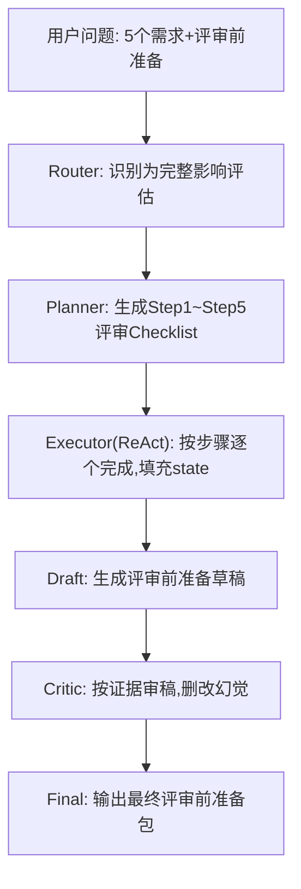
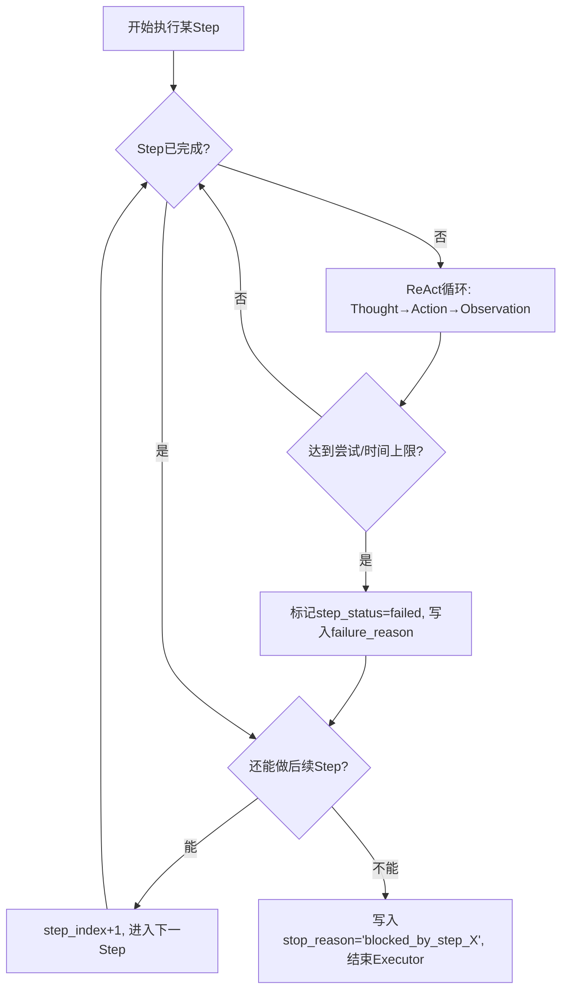
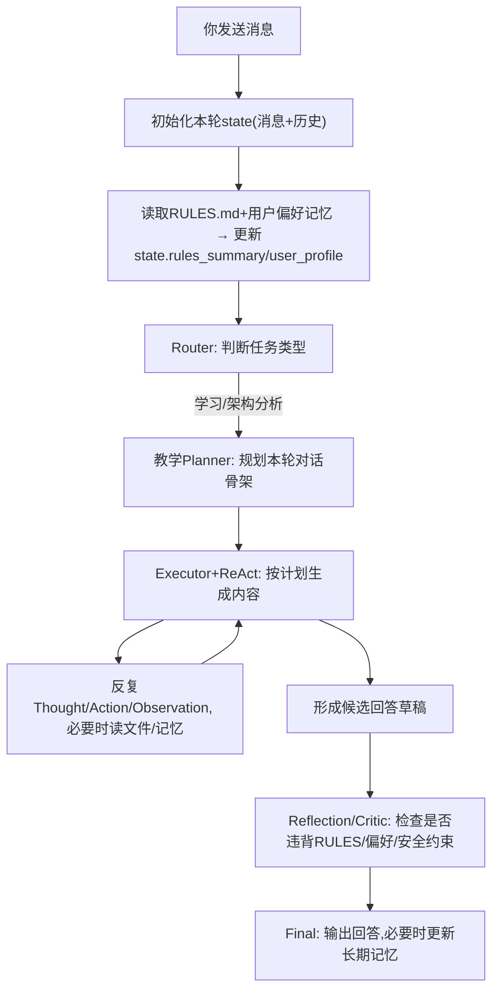

# 学习笔记 - 2025-12-18

## 1. 会话概览 (Session Overview)

- 日期: 2025-12-18
- 时长: ~60 分钟
- 主要主题:
  - B.2 Planner (先规划再执行) 与 ReAct 的分工
  - 需求评审助手的 Router → Planner → ReAct → Critic 流程细化
  - State Graph 视角: state 字段设计与读写关系
  - Executor 异常处理: step_status, failure_reason, stop_reason
  - Reflection/Critic 自我审查模式与信任边界
  - Qoder 自身从收消息到回答的 Agent 流程

---

## 2. 核心交互记录 (Interaction Log)

> 针对每一个讨论的知识点,按模板记录: 我的初始误解 → 你的解释 → 理解检查。

### 主题 1: Planner vs ReAct & manus 的定位

- 我的问题/场景 (My Question/Scenario):
  - manus 这类工具是不是典型的 Planner? 先列任务清单再一个个执行,和 ReAct 有什么本质区别?

- 我的初始理解 (My Initial Understanding):
  - [x] 觉得 manus 是“先规划再执行”的代表,属于 Planner 风格。
  - [ ] 不清楚 Planner 步骤出问题以后,是否会自动退回 ReAct 模式或触发重规划。

- 提供的解释 (Explanation Given):
  - Planner 负责生成可执行的步骤清单(路线图),Executor/执行器负责按步骤执行;在复杂步骤内部,往往会嵌套 ReAct 小循环来应对不确定性。
  - manus 的对外体验接近“Planner + 执行器组合”: 先产出任务列表,再逐条调工具/模型完成,执行阶段经常带一点 ReAct 味道。
  - Planner 侧重结构化、可解释的 Checklist; ReAct 侧重在信息不确定时边查边想的探索能力,两者常常串联使用。

- 理解检查 (Comprehension Checks):
  - 问题(Q): 如果 Planner 列好的某一步在执行时失败(查不到信息/工具超时),可能会发生哪几种处理方式?
  - 我的回答: 会标记该步骤失败并记录原因,然后要么在这一步内部用 ReAct 多轮尝试“救火”,要么判断能否继续后续步骤,必要时触发重新规划。
  - 标记: ✓ 大体正确
  - 洞察: Planner 给的是“初始计划”,执行过程中需要有机制容纳失败与调整,而不是把路线图当成死规定。
  - 理解程度: 良好

---

### 主题 2: 需求评审助手的 Planner → ReAct → Critic 细化

- 我的问题/场景 (My Question/Scenario):
  - 希望把“根据 5 个需求文档做计费影响评审前准备”这件事画成完整流程,并拆清楚每个节点具体干什么。

- 我的初始理解 (My Initial Understanding):
  - [x] 直觉上要先列评审 Checklist(Planner),再按步骤去查文档/做判断(ReAct)。
  - [ ] 还没把每个 Step 的输入输出、写入哪些 state 字段想清楚。

- 提供的解释 (Explanation Given):
  - Router 识别任务为“完整影响评估”,将意图写入 state.intent_type。
  - Planner 只负责在 state.plan_steps 里列出 Step1~Step5: 抽计费内容、标记本次变更、判断是否影响价格、汇总影响点、生成问题清单。
  - Executor 读取 plan_steps, 对每个 Step 运行小型 ReAct 循环,逐步填充 state.billing_segments / billing_changes / price_impact_points / price_impact_summary / questions_for_third_party。
  - Draft 节点基于这些结构化字段生成“评审前准备草稿”; Critic 节点负责删掉无证据的结论、降级过度肯定的表述,输出最终报告。

- 理解检查 (Comprehension Checks):
  - 问题(Q): 在这个流程里,state 的核心作用是什么? 为什么不能只靠“当前轮的上下文”来判断?
  - 我的回答: state 就是这次任务的“总工作台+档案袋”,从用户问题、文档到每个步骤的中间结果都放在里面; 后续节点可以重复读取已有成果,避免每个节点重新查一次,也方便在最终报告中找到证据来源。
  - 标记: ✓ 正确
  - 洞察: 和 ReAct 里的 history 类似,state 把跨节点的上下文集中管理,是整个 State Graph 的“共享记事本”。
  - 理解程度: 良好

---

### 主题 3: Executor 异常处理与 step_status/stop_reason

- 我的问题/场景 (My Question/Scenario):
  - 如果某个 Step 一直查不出结果或者工具总报错,评审流程应该怎么停、怎么记? 不希望流程“悄悄失败”却在报告里装作没事。

- 我的初始理解 (My Initial Understanding):
  - [x] 需要记录“这个步骤失败了”和“失败原因”,避免事后看不出到底卡在哪。
  - [ ] 没有系统想过“部分完成 vs 完全失败”的区分,以及 stop_reason 应该长什么样。

- 提供的解释 (Explanation Given):
  - Executor 在每个 Step 内部通过 ReAct 多轮尝试,达到重试/时间上限仍失败时,将该 Step 标记为 failed,并写入 step_failure_reasons[step_id]。
  - 然后判断: 如果仍然能做后续 Step,整体任务可以继续并标记为 partial; 如果关键 Step 失败导致后续完全没法做,则提前终止,写入 stop_reason="blocked_by_step_X_..."。
  - Draft/Critic 需要读取这些状态,在报告中显式告诉读者: 哪些部分已经评估,哪些因为信息缺失或错误而无法判断。

- 理解检查 (Comprehension Checks):
  - 问题(Q): 当某一步“怎么试都不行”时,Executor 至少应该做哪三件事?
  - 我的回答: 1) 标记这个步骤失败; 2) 说明失败原因; 3) 决定能不能继续执行后续步骤,以及是否需要提前结束整个任务。
  - 标记: ✓ 正确
  - 洞察: 失败路径也是产品的一部分,要在 state 和报告中都被清楚地表达出来,而不是“悄悄吞掉”。
  - 理解程度: 良好

---

### 主题 4: Reflection/Critic 自我审查模式与信任边界

- 我的问题/场景 (My Question/Scenario):
  - 我不太信任“同一模型在同一轮对话里自我审查”,更倾向让它在新一轮或者让另一个 AI 来做 Reviewer,避免自己给自己放水。

- 我的初始理解 (My Initial Understanding):
  - [x] 觉得至少要“新一轮调用 + 新角色”,才算真正的 Reflection,而不是顺嘴说一句“我已经检查过了”。
  - [x] 实际使用中,会先让模型在提示词里自查,不放心时再把结果丢给另一家模型批判。

- 提供的解释 (Explanation Given):
  - Reflection 模式至少分两种: Self-Reflection(同一模型,但新一轮专职审稿) 和 Actor-Critic(另一个模型/角色专门挑刺)。
  - 关键不是“是不是同一个模型”,而是: 是否单独开了一轮“作为 Reviewer 的思考”,并且有明确的审稿标准(对题,有证据,无过度承诺)。
  - 在“结果会被领导/研发当真”的场景下,Critic 节点是强制的,负责删除无证据结论、降低语气、列出不确定项,避免幻觉直接流入正式沟通。

- 理解检查 (Comprehension Checks):
  - 问题(Q): 如果在需求评审助手里关掉 Critic 节点,最大的风险会出在哪里?
  - 我的回答: 草稿里那些没有证据、甚至是幻觉的句子会直接出现在给领导或研发看的说明里,他们会按这些“假事实”做判断,一旦错了责任在我,风险非常大。
  - 标记: ✓ 正确
  - 洞察: 对外/对决策场景,Reflection 不是“锦上添花”,而是防止自己被幻觉坑死的安全阀。
  - 理解程度: 良好

---

### 主题 5: Qoder 自身的 Agent 流程(State Graph 视角)

- 我的问题/场景 (My Question/Scenario):
  - 想把“我给 Qoder 发一条消息到你返回答案”这整条链路,也当成一个 Agent 场景来分析,看中间经历了哪些节点和状态变化。

- 我的初始理解 (My Initial Understanding):
  - [x] 模糊知道你会读 RULES 和我的偏好记忆,但没用统一的 Router/Planner/Executor/Reflection 语言去描述。
  - [ ] 还没把整个过程画成一张清晰的 State Graph。

- 提供的解释 (Explanation Given):
  - 每轮消息会初始化一次本轮 state,写入 user_message 和 conversation_history。
  - 之后自动读取 RULES.md 与用户偏好记忆,更新 state.rules_summary 与 state.user_profile,保证本轮思考遵守最新约束。
  - Router 判断这是“学习/架构分析”任务,切入教学模式的 Planner: 先定本轮要走的教学骨架(总览→细拆→画图→理解检查)。
  - Executor+ReAct 在内部反复 Thought → Action(读文件/读记忆/搜索) → Observation,组织出候选回答,最后由 Reflection 层检查是否违反 RULES/偏好/安全要求,再真正输出。

- 理解检查 (Comprehension Checks):
  - 问题(Q): 在这个流程里,state 的作用和之前的需求评审助手相比,有什么共同点?
  - 我的回答: 本质一样,都是这次任务的统一工作台: 记录输入(我的问题、历史对话),记下中途读到的规则/偏好,以及中间观察结果;不同节点只是对这坨 state 做读写,靠它把 Router/Planner/Executor/Reflection 串成一条完整链路。
  - 标记: ✓ 正确
  - 洞察: 无论是业务 Agent(需求助手)还是“教学用的 Qoder 自己”,底层都是一套 State Graph 语言在支撑。
  - 理解程度: 良好

---

## 3. 🗺️ 流程图存档 (Diagram Archive)

### 图表 1: 需求评审助手 Router → Planner → ReAct → Critic 总览

### 图表 2: Executor 异常处理与 step_status/stop_reason

### 图表 3: Qoder 在本仓库中的自我 State Graph

---

## 4. 识别出的知识盲区 (Knowledge Gaps Identified)

主题 | 严重程度 | 备注
--- | --- | ---
ReAct 在 LangGraph 中的 State Graph/节点建模与接口设计 | 中 | 还没有在具体框架中实践,不清楚节点函数签名、Checkpointer 如何持久化state
Reflection/Actor-Critic 模式的具体落地策略 | 中 | 还不够清楚: 什么时候用单模型多轮自审,什么时候要上双模型Actor-Critic,以及如何评估成本vs安全收益
将「我+manus+其他AI」的组合抽象成统一 State Graph | 低 | 直觉上有 Planner+Executor+Critic 的味道,但还没画过完整流程图

---

## 5. 今日掌握的主题 (Topics Mastered Today)

主题 | 信心指数 | 备注
--- | --- | ---
Planner 与 ReAct 的分工 | 中 | 能用"Planner先写Checklist,Executor/ReAct按Checklist填满state"的语言描述两者关系,理解失败时需要重试/重规划机制
State 作为Agent流水线的统一工作台 | 中 | 理解state承载输入、计划、中间结果和失败信息,Router/Planner/Executor/Reflection都只是对这坨state的不同读写
Reflection/Critic 在需求评审助手中的角色 | 中 | 明白对外汇报/高风险场景下, Critic是强制安全阀,负责删改无证据结论并列出不确定项

---

## 6. 下次会话行动项 (Action Items for Next Session)

- [ ] 用"我+manus+另一家AI"的真实使用习惯,画出一张自己的State Graph,对比今天的Qoder流程
- [ ] 进一步整理Reflection/Critic的通用审稿Checklist(检查哪些点、输出什么结构)
- [ ] 继续巩固需求评审助手的完整流程,尝试用更简短语言复述一遍 Router→Planner→Executor→Draft→Critic