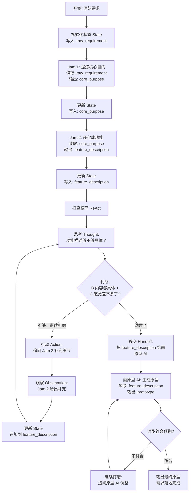

# 学习笔记 - 2025-12-21

## 1. 会话概览 (Session Overview)

- 日期: 2025-12-21
- 时长: ~40 分钟
- 主要主题:
  - 复习验证：规划器（Planner）、状态（State）、自我审查（Reflection）
  - 实践落地：用户真实工作流的状态图（State Graph）建模
  - 初步接触：C.1 移交与路由（Handoffs）多智能体协作

---

## 2. 核心交互记录 (Interaction Log)

### 主题 1: 复习验证 - 规划器/状态/自我审查

#### 我的问题/场景 (My Question/Scenario)
需要验证之前学习的三个核心概念是否真正掌握：规划器（Planner）、状态（State）、自我审查（Reflection/Critic）

#### 验证题与我的回答

**验证题 1：规划器（Planner）的优缺点**
- **问题**：先列步骤清单再执行的做法，最大好处和坏处是什么？
- **我的回答**：
  - 好处：流程清晰，后续步骤可以按计划行事，整体可控
  - 坏处：不够灵活，只会按步骤执行，如果计划出问题需要推倒重来或结束任务
- **标记**：✓ 正确
- **洞察**：规划器（Planner）常常需要和边走边看循环（ReAct）搭配使用，规划器负责列大纲，执行器内部用 ReAct 应对不确定性
- **理解程度**：良好

**验证题 2：状态（State）的作用**
- **问题**：如果没有状态（State），每个步骤只能看上一步输出，会出什么问题？
- **我的回答**：第一步已经规划好输出好的内容，第三步因为看不到需要再次搜索，如此反复，浪费时间和 Token
- **标记**：✓ 正确
- **洞察**：状态（State）是共享工作台，避免重复劳动。类比：做 PPT 时每页都基于同一份素材库（State），而不是每页重新上网找图
- **理解程度**：良好

**验证题 3：自我审查（Reflection）的信任边界**
- **问题**：让 AI 自己检查自己，至少要满足哪 2 个条件才能稍微信任？
- **我的回答**：
  - A. 如果是同一个 AI，起码不能看之前的对话，需要全新对话
  - B. 或者需要一个全新的 AI 来做第三方审查
- **标记**：△ 部分正确
- **补充**：除了"新对话/新 AI"，还需要**明确的审稿标准（Checklist）**：
  - 是否所有结论都有证据支撑？
  - 是否有过度承诺的表述（"一定"、"肯定"）？
  - 是否有遗漏的关键信息？
- **洞察**：审稿标准是让自我审查可信的关键，不能只是"帮我看看"
- **理解程度**：良好（补充审稿标准概念后）

---

### 主题 2: 实践落地 - 真实工作流的状态图建模

#### 我的问题/场景 (My Question/Scenario)
用状态图（State Graph）语言描述真实工作流：从原始需求到最终原型的完整过程

#### 我的工作流描述

**整体流程：**
1. 原始需求 → Jam 1（提炼核心目的）
2. 核心目的 → Jam 2（转化成功能）
3. 功能描述 → 多轮打磨（和 Jam 2 反复沟通）
4. 最终功能 → 画原型 AI
5. 原型输出 → 需求落地完成

**关键细节确认：**

**问题 1：状态（State）里记录什么？**
- 我的回答：Jam 2 的功能描述会一直带着，这个是有价值的
- 洞察：状态里只保留核心成果，不是所有中间过程都要记录

**问题 2：什么时候结束打磨？**
- 我的回答：B（看内容）+ C（凭感觉）都有
  - B：功能描述足够具体、没有歧义
  - C：直觉上觉得可以进入下一步了
- 洞察：判断标准是混合的，既有客观标准也有主观感受

**问题 3：如果中间某步失败怎么办？**
- 我的回答：C - 手动调整继续走，其实不是手动调整，就是跟 AI 反复打磨
- 洞察：失败处理 = 反复打磨（ReAct 循环），不会推倒重来也不会放弃，而是在当前步骤内部多轮沟通直到满意

#### 提供的解释 (Explanation Given)

**状态图（State Graph）建模：**

通过这个流程，已经在实际使用以下智能体（Agent）模式：

1. **边走边看循环（ReAct）**
   - 在和 Jam 2 打磨功能描述时
   - 在和画原型 AI 调整原型时

2. **状态管理（State）**
   - 用 `state.feature_description` 记录核心成果
   - 后续节点直接从 state 读取，不用重新生成

3. **移交与路由（Handoffs）**
   - Jam 1 → Jam 2 → 画原型 AI
   - 像接力赛一样传递任务

4. **多智能体协作（Multi-Agent）**
   - 3 个不同角色的 AI 工具协作完成一个完整任务

#### 📊 本主题的流程图

📝 说明：这个流程图完整展示了从原始需求到最终原型的多智能体协作过程，核心包含：状态管理、ReAct 循环打磨、智能体间移交

#### 理解检查 (Comprehension Checks)

**未完成部分（待下次继续）：**

**问题 1：状态（State）的价值**
- 如果没有状态（State），只能每次把上一步输出直接传给下一步，会出什么问题？
- 提示：想想画原型 AI 如果只能看到"功能描述的最后一轮回复"，会发生什么？

**问题 2：ReAct 循环的终止条件**
- 判断"差不多了"的标准是 B（内容）+ C（感觉），如果要把这个标准交给 AI 自己判断，需要给 AI 什么样的检查清单？

**问题 3：移交（Handoff）的关键**
- 从 Jam 2 移交给画原型 AI 时，除了传递 feature_description，还需要传递其他信息吗？

---

## 3. 识别出的知识盲区与下次行动项

### 知识盲区表

| 主题 | 严重程度 | 备注 | 解决状态 |
|------|--------|------|--------|
| 自我审查（Reflection）的审稿标准设计 | 中 | 知道需要"新对话/新AI"，但对具体的审稿 Checklist 还不够清晰 | 部分解决 |
| ReAct 循环的自动终止条件 | 中 | 目前依赖人工判断"差不多了"，如何让 AI 自己判断终止条件还不清楚 | 未解决 |
| 移交（Handoff）时的信息传递策略 | 低 | 不确定移交时是只传核心成果还是需要带上更多上下文 | 未解决 |

### 🎯 针对上述盲区的下次行动项

- [ ] **完成理解检查题 1-3**：
  - 回答状态（State）的价值验证题
  - 设计 ReAct 循环的自动终止 Checklist
  - 分析移交（Handoff）的信息传递策略

- [ ] **深入学习 C.1 移交与路由（Handoffs）**：
  - 学习多智能体之间如何传递状态
  - 理解路由（Router）如何判断该把任务交给谁
  - 学习移交失败的处理机制

### 📋 行动项-盲区映射

| 行动项 | 对应盲区 | 优先级 |
|--------|--------|--------|
| 完成理解检查题 1-3 | ReAct 终止条件、Handoff 信息传递 | 高 |
| 深入学习 C.1 Handoffs | 移交策略、多智能体协作 | 高 |

---

## 4. 本次掌握的主题总结 (Topics Mastered Today)

| 主题 | 信心指数 | 备注 | 来源 |
|------|--------|------|------|
| 规划器（Planner）的优缺点与适用场景 | 良好 | 能说清楚"可控 vs 灵活"的权衡，理解需要和 ReAct 搭配使用 | 主题 1 验证题 1 |
| 状态（State）作为共享工作台的核心作用 | 良好 | 理解状态避免重复劳动和浪费 Token，能用 PPT 素材库类比 | 主题 1 验证题 2 |
| 自我审查（Reflection）的信任边界 | 良好 | 知道需要"新对话/新 AI" + 审稿标准两个条件 | 主题 1 验证题 3 |
| 真实工作流的状态图（State Graph）建模 | 良好 | 能用状态图语言描述 Jam 1 → Jam 2 → 画原型 AI 的完整流程，识别出 ReAct / State / Handoffs / Multi-Agent 四种模式 | 主题 2 |

---

## 5. 下次会话开始点 (Resume Point)

**当前进度：**
- ✅ 完成：复习验证（规划器/状态/自我审查）
- ✅ 完成：真实工作流的状态图建模
- ⏸️ 暂停点：理解检查题 1-3（待回答）
- 📌 待学习：C.1 移交与路由（Handoffs）深入讲解

**下次会话计划：**
1. 回答理解检查题 1-3
2. 根据回答情况深化对应概念
3. 正式学习 C.1 移交与路由（Handoffs）
4. 完成今日会话记录并更新进度追踪器
