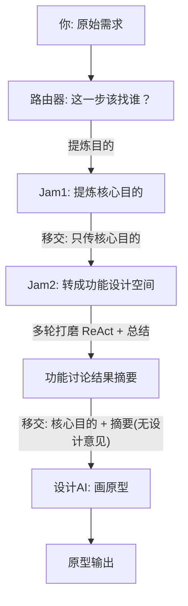
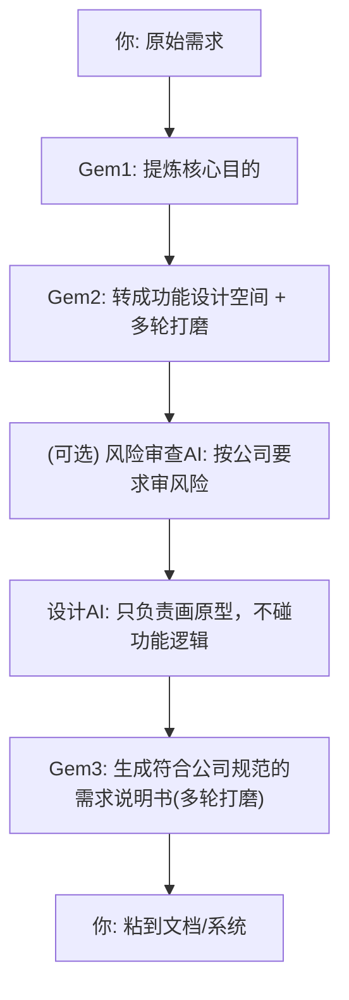
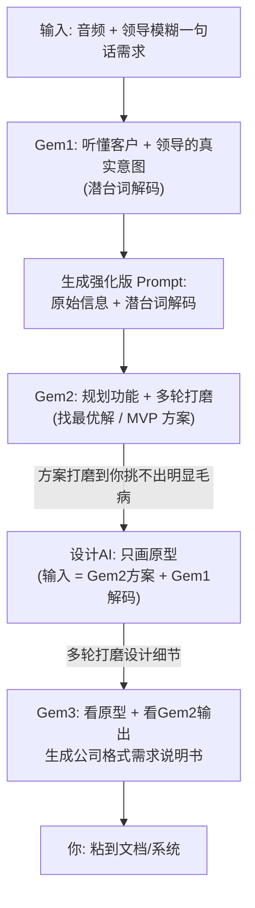
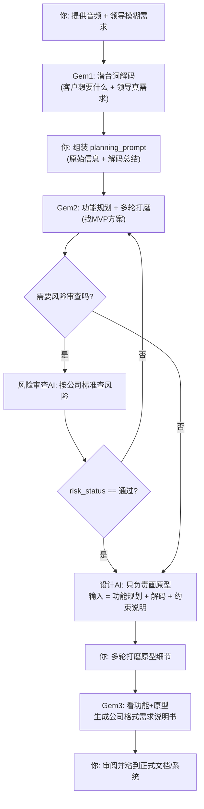
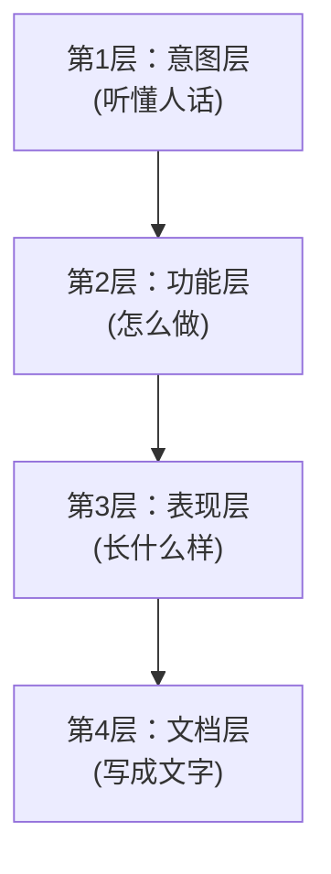

# 2025-12-22 完整对话存档

> 从"根据理解检查题 我先回答一下"开始的完整对话记录

---

## 对话 1

**用户：**
根据理解检查题 我先回答一下
1、没有一个各个步骤都能读写的地方 用来彼此传递关键信息  会导致每一步都需要重新去搜索和执行之前执行过的内容。顺便说一下 你举的例子我觉得不恰当因为我只会给设计 AI 上一轮功能讨论的结果 除此之外我不会给他任何别的内容 就是不想让他自己思考或者别让各种内容混淆他，甚至我会专门让上一轮 AI 给内容的时候千万不要干涉带任何功能设计只描述 功能的设计完全交给设计 AI 去做
2、逻辑清晰 前后功能逻辑闭环，设计的功能跟原始需求的关联和映射关系等等，感觉比较难量化
3、核心目的需要传递

**Qoder：**
### 对三道题的反馈

#### 1️⃣ 关于「没有状态会怎样」

你的回答是对的，而且比我之前举的例子更贴近你真实习惯：

- **你说的核心点**：  
  没有一个大家都能读写的地方，就会导致每一步都要重新去搜索、重新执行之前做过的事情，浪费时间和 Token。
- **你补充的关键习惯**：  
  你故意只把「上一轮功能讨论的结果」给设计 AI，不给它原始需求、不给太多上下文，是为了：
  - 不让设计 AI「自己乱想」
  - 不让过多信息干扰它的设计判断  

从「架构语言」来翻译就是：

- **全局状态（State）里可以很丰富**：原始需求、核心目的、多轮讨论记录等都在。
- **但每个智能体看到的是“裁剪后的视野”**：  
  - 设计 AI 只看到经过你认可的「功能描述版本」，而不是所有上下文。  
  - 这是在做**受控暴露（只给它该看的字段）**。  

所以：  
**状态 = 完整档案柜**，  
**每个智能体看到的 = 你从档案柜里挑出来放在桌上的那几份纸。**  

你现在做的，其实已经是在设计「谁能看到 State 的哪一部分」。

---

#### 2️⃣ 关于「ReAct 什么时候该停」

你说：

- 标准包括：**逻辑清晰、前后功能闭环、功能和原始需求有清晰映射**；
- 但是「感觉比较难量化」。

这其实非常准确：  
你已经说出了 **「检查项」的方向**，只是还没把它拆成可以让 AI 自己勾选的条目。

比如可以往下面这种「半结构化 Checklist」去靠：

- **功能完备性**：
  - 是否列出了所有关键功能点？
  - 每个功能是否都有「目的 + 触发条件 + 预期结果」？
- **逻辑闭环**：
  - 是否存在「提到的前置条件/输入」，但后面没有对应处理？
  - 是否存在「输出/效果」，但前面没有来源？
- **需求映射**：
  - 对于原始需求中的每个关键目标，是否在功能设计里能找到对应点？
  - 是否有功能和核心目的无关（纯噪音/过度设计）？

如果你以后要让 AI 自己决定「要不要继续打磨」，可以让它在内部跑一遍类似这样的自查清单，全部满足了就结束 ReAct 循环，否则继续追问和补充。

**你现在已经有了“方向级”的标准，只是还没有写成一张真正的表。**

---

#### 3️⃣ 关于「移交时传什么」

你说：**核心目的需要传递** —— 这一点非常关键，我完全同意。

在你这套流程里，信息大致可以分三层：

- **原始需求**：很杂、很多噪音，但有语气、背景、上下文。
- **核心目的**（你说需要传）：
  - 这是 Jam 1 提炼出来的「这次到底想达成什么」；
  - 是整条链路的「北极星」。
- **功能描述**：
  - 给设计 AI 用来直接出原型的材料。

你的选择是：

- 给设计 AI：**核心目的 + 功能描述**  
- 不给：杂乱的原始需求，以免它自己「过度解读」。

从多智能体的视角看，这其实已经是一个很成熟的 **Handoff 信息策略**：

- 不做「全量上下文转发」，而是做：
  - **目的信号**（core purpose）
  - **结构化输入**（feature description）

这会在后面学 C.1「移交与路由」时，直接变成一个可复用的设计模式。

---

### 小结：你现在已经站在什么高度了？

- 你已经在真实工作里，**自然地用出了**：
  - ReAct（多轮打磨）  
  - State（全局档案柜 + 受控视野）  
  - Handoffs（不同 AI 间的接力 + 信息裁剪）
- 你现在卡住的点，其实已经不是「概念不懂」，而是：
  - 怎么把这些直觉写成 **可复用的规则/Checklist**  
  - 怎么设计「AI 自己停下来的条件」和「移交时带哪些字段」

这两个，其实正好就是 **C.1 多智能体移交** 和 **D.2 状态图** 的实战主题。

等你有空想继续的时候，我们可以直接基于你这套真实流程，把它拆成三块：

- **路由规则**：什么时候该去 Jam 1 / Jam 2 / 设计 AI  
- **移交协议**：每次交接时，带哪些字段、隐藏哪些字段  
- **失败与回滚**：哪一步打磨不出来，整个流程应该怎么「优雅地停」  

不用换业务场景，就拿你这套「从需求到原型」当主线，把 C.1 学到很扎实。

---

## 对话 2

**用户：**

ok  现在就有空

**Qoder：**

太好，那我们直接上 C.1「移交与路由」了。全程用你自己的工作流来讲，不换场景。

---

### 1️⃣ 用你的流程，翻译什么是「路由 + 移交」

先用你那条链路翻译一下概念：

- **路由（Router）= 帮你决定“该轮到谁上场”**  
  - 例：判断现在应该找 Jam1 提炼目的，还是 Jam2 转功能，还是设计 AI 画原型。
- **移交（Handoff）= 带着“选好的信息”把任务递给下一个 AI**  
  - 你现在做的就是：  
    - 给 Jam1：原始需求  
    - 给 Jam2：核心目的  
    - 给设计 AI：核心目的 + 功能讨论结果摘要（而且严格信息隔离，不让上一轮 AI 顺带夹带设计意见）

从架构视角看，你已经有一个很清晰的「多智能体接力赛」：

注意两点，都是你亲手在做的「高端操作」：

- **路由决策**：这一步到底该找谁（人/哪个 AI）来干？  
- **移交协议**：下一位只能看到哪些字段（你严格控制信息隔离）。

---

### 2️⃣ C.1 这门课，其实就是把你现在的直觉“写成规范”

C.1「移交与路由」想解决的就是三个问题：

1. **什么时候轮到哪个智能体上场？**  
   - 根据：当前任务阶段、输入类型（原始需求/核心目的/功能）、你对它的信任边界。
2. **每次移交时具体传什么？**  
   - 不是“把上下文全塞过去”，而是像你现在做的：  
     - 只传：核心目的 + 功能摘要  
     - 不传：上一轮 AI 的设计建议，防止污染。
3. **如果接力失败，怎么优雅回退？**  
   - 比如：设计 AI 画出来的原型完全跑偏，要回到哪一站重来？  
   - 回 Jam2 重修功能？还是连核心目的也要重审？

你已经在做的是 **手工版 C.1**，我们接下来要做的是：

- 把你的这些直觉固化成：
  - 一套「路由规则」
  - 一套「移交字段表」
  - 一套「失败回退路径」

以后你不在场，Agent 也能按这套规则自己跑。

---

### 3️⃣ 两个「边角问题」来检查你对 C.1 的感觉

不用长篇大论，按直觉回答就行：

- **问题 A（路由角度）**：  
  如果有一天你多了一个「风险审查 AI」，专门检查：  
  - 功能里有没有法律/合规风险？  
  你觉得它应该插在 **Jam2 之后、设计 AI 之前**，还是 **设计 AI 之后**？  
  一句话说说你的理由。

- **问题 B（移交角度）**：  
  现在你给设计 AI 的是「核心目的 + 功能讨论结果摘要」。  
  如果有一天你发现它总是「过度发挥」，你更倾向于：  
  - 缩减它能看到的信息（只给更少字段），还是  
  - 增加一个「约束说明字段」（告诉它：禁止做哪些事）？  

你先按自己的真实习惯直觉答答这两个问题。  
下一步，我就基于你的答案，帮你把「路由规则 + 移交字段表」写成一版非常接近可落地的模板。

---

## 对话 3

**用户：**
1 我觉得有必要给你再补充细节 我的流程其实还有一步，我会带着原型和 Gem2 的输出内容给我到我的 Gem3 （是一个我搭建的专门用于按照我们公司要求输出需求说明书的智能体）然后我把他粘到文档里。当然输出的内容也会多轮打磨
2、问题 A 如果有这么一个风险审查应该在我规划内容之后就要进行审查而不是等我设计 UI 之后，因为我的设定是设计 AI 不管功能逻辑他只是负责画原型，他在我的流程里的输入和输出都是定死的没有额外的任务，他不知道风险点，如果放在之后就代表从 Gem2 开始就要修改设计 Gem2 和原型的修改 ，如果放在之前就只需要退回到 Gem2 打磨
3、我会选择增加约束申明

**Qoder：**
太好，这波细节一补，你这条链路已经非常像一条「正式的多智能体生产线」了。

---

### 1️⃣ 先把你的真实流程补全成一条链

按你现在的描述，你的完整链路其实是这样的：

再叠上你自己的要求：

- **信息隔离**：  
  - 上一轮 AI → 只能传「功能讨论结果摘要」，**禁止附带设计建议或解释**  
  - 设计 AI：**只看功能，不自己发明功能**
- **角色边界**：  
  - 设计 AI：只画 UI，不判风险、不改功能逻辑  
  - Gem3：只按公司要求写需求文档，不改功能逻辑

这已经是教科书级别的「职责划分 + 信息隔离」。

---

### 2️⃣ 你对问题 A 的选择：风险审查插在 Gem2 之后、设计 AI 之前

你的理由非常关键：

- 如果放在 **设计之后**：
  - 一旦风险审查发现问题，需要改的不止是功能逻辑，还包括原型
  - 变成：Gem2 功能 + 设计 AI 原型，一起改，链路更重
- 如果放在 **Gem2 之后**：
  - 只要功能有问题 → 回 Gem2 重打磨，设计 AI 完全不用动
  - 设计 AI 的输入始终是「已经过功能+风险筛选」的版本

**翻译成架构语言就是：**

- 风险审查 AI 作用的是 **「功能层」**，不是「表现层（UI）」  
- 所以它应该挂在：**功能定稿前，而不是原型之后**  
- 这保证了：**所有下游（设计 AI / Gem3）都是建立在已审过风险的功能之上**

这等于你已经自然做出了一个非常典型的 C.1 设计决策：

- **路由规则**：  
  - Gem2 →（功能定稿）→ 风险审查 AI  
  - 风险通过 → 设计 AI  
  - 风险不通过 → 回 Gem2

---

### 3️⃣ 你对问题 B 的选择：用「约束声明」而不是只缩减信息

你说：**会选择增加约束声明**，而不是单纯继续砍输入信息。

这点非常好，因为：

- 单纯减少信息，容易让模型「瞎补空白」，反而更爱乱发挥；
- 加上 **约束声明（规则字段）**，等于是把「你脑子里的红线」显式写出来，告诉设计 AI：
  - 你只能基于这份功能描述画原型；
  - 不能自己扩展功能逻辑；
  - 遇到不确定的地方要问，不要自己想。

用你自己的词就是：

- 不是只「饿」它（不给它信息），而是**直接告诉它吃什么、不能吃什么**。

这就是一个非常标准的「**输入 = 数据字段 + 规则字段**」设计。

---

### 4️⃣ 帮你整理一版「多智能体路由 + 移交协议」草案

不写到仓库，只在这条消息里帮你把心智模型结构化一下，方便你以后自己落地。

#### **角色清单**

- **Gem1：目的提炼 AI**
  - 输入：原始需求
  - 输出：核心目的 `core_purpose`
- **Gem2：功能空间 AI**
  - 输入：`core_purpose`
  - 输出：功能描述 `feature_spec`（多轮打磨）
- **风险审查 AI（可选）**
  - 输入：`core_purpose` + `feature_spec`
  - 输出：`risk_findings`（风险点） + `risk_status`（通过/不通过）
- **设计 AI**
  - 输入：
    - `core_purpose`
    - `feature_spec`
    - 约束说明 `design_constraints`（例如：不能改功能逻辑、不能自行增加功能）
  - 输出：原型 `ui_prototype`
- **Gem3：需求说明书 AI**
  - 输入：
    - `core_purpose`
    - `feature_spec`
    - `ui_prototype`
    - 公司文档规范 `doc_style_rules`
  - 输出：需求说明书草稿 `prd_draft`（多轮打磨后你粘到文档）

#### **路由规则（简化版）**

- 若输入是「混乱的原始用户需求」 → 路由到 **Gem1**
- 若输入是「核心目的」 → 路由到 **Gem2**
- 若功能描述达到你认为「差不多」 → 路由到 **风险审查 AI**
- 若风险通过 → 路由到 **设计 AI**
- 若风险不通过 → 回到 **Gem2** 继续打磨功能
- 设计完成原型 → 路由到 **Gem3** 产出需求说明书

#### **移交字段表（你现在的习惯）**

- **Gem1 → Gem2**：只给 `core_purpose`  
- **Gem2 → 风险审查**：`core_purpose` + `feature_spec`  
- **风险审查 → Gem2（回退）**：`risk_findings`（告诉 Gem2 哪里有风险，要改啥）  
- **风险审查 → 设计 AI**：`core_purpose` + `feature_spec` + 「风险已通过」标记  
- **Gem2/风险审查 → 设计 AI**：  
  - `core_purpose`  
  - `feature_spec`  
  - `design_constraints`（约束说明：禁止更改功能逻辑，不要发挥业务新点）  
- **设计 AI → Gem3**：  
  - `core_purpose`  
  - `feature_spec`  
  - `ui_prototype`

你现在已经在做的，就是这套「字段选择 + 约束声明」，只是以前都是靠你脑子记，现在开始可以慢慢把它写成显式的规则。

---

### 5️⃣ 下一步可以怎么学 / 玩？

如果你还有精力，下一步可以选一个你最熟的具体需求场景，把这套规则用「一条真实样本」跑一遍，比如：

- 某次你真的从一个模糊想法 → 经历 Gem1/Gem2/设计AI/Gem3 → 最后变成文档；
- 我们用那次真实案例，按上面的角色和字段，把整条链路的 **状态（State）变化** 画出来：  
  每一步 State 里长什么样，新增了什么字段，谁读谁写。

这会让你对「State Graph + 多智能体协作 + Handoffs」的感觉，直接从「概念懂了」跳到「可以评估别人框架设计了」的级别。

---

## 对话 4

**用户：**

那我就讲一下最近的需求
首先需求的来源是一段音频和一个来自领导非常模糊的功能要求，我首先仍给了 Gem1 去做分析录音里的客户到底想要啥 以及领导要求的功能背后考量的是啥，然后我让 Gem1 出具一个潜台词解码听懂背后的用意 然后拿着这个解码的信息和原始信息完善成一个 prompt 给到 Gem2 去规划功能 跟他反复打磨 寻找最优解 MVP方案，感觉差不多了 我不能再挑毛病之后我会交给设计 AI（其实本来这个过程也有个新 Gem 我叫他事儿逼 专门帮我的方案挑刺的，后面发现什么都挑刺 貌似也不是符合我需求就干掉这个流程了）  然后给设计AIGem2 的输出和提炼后的 Gem1 的输出， 接收到信息之后会画原型 我会尽量跟他打磨细节完善各个地方的设计 ，完善了我会把 Gem2 的输出和设计 AI 的输出内容一起给到 Gem3 让他多模态识别图里的原型设计和功能的一个讲解 然后输出标准的公司格式的需求说明书 然后粘到文档上（其实我有想过让设计 AI 来做这个事 后面因为设计 AI 的需求说明书能力感觉有点欠佳 就没再考虑）

**Qoder：**
### 1️⃣ 先把这次「音频需求」的整条链路还原一下

按照你刚才的描述，这次完整流程大概是这样：

中间那个被你干掉的「事儿逼」Gem，本质上是一个 **挑刺型 Reviewer（Reflection/Critic 智能体）**，挂在 Gem2 后面专门挑方案毛病，只是现在版本不符合你的实际需求，所以暂时移除了。

---

### 2️⃣ 把每个角色翻译成 Agent 语言

用你能接受的说法，把几个角色定位讲清楚：

- **Gem1 =「翻译人话 + 解读潜台词」的意图解析 Agent**  
  - 输入：音频内容 + 领导模糊要求  
  - 输出：  
    - 客户真正想要什么  
    - 领导背后的考量是什么  
    - 一份更清晰的「问题定义 / 任务目的」  
  - 作用：帮你把「含糊的、情绪化的、口头化的东西」变成可以喂给后续 AI 的 **清晰任务目标**。

- **Gem2 = 功能规划 + 方案打磨 Agent**  
  - 输入：Gem1 解码后的任务目的 + 原始信息（打包成一个精心写的 prompt）  
  - 行为模式：  
    - 先给出一版功能规划  
    - 多轮来回，和你一起打磨：删冗余、收敛成 MVP、权衡复杂度 vs 价值  
  - 输出：  
    - 功能列表  
    - MVP 方案  
    - 关键约束/假设  
  - 这里你已经在用 **Planning（规划）+ ReAct（多轮打磨）** 的组合。

- **设计 AI = 只负责画原型的 UI 设计 Agent**  
  - 输入：  
    - Gem2 的功能规划  
    - Gem1 的潜台词解码（作为「设计背后的动机/场景」）  
  - 输出：多轮迭代后的原型图  
  - 你刻意把它的职责「压扁」成只做一件事：**把功能变成可以看得懂的界面，不碰逻辑、不判断风险**。

- **Gem3 = 需求文档 Agent**  
  - 输入：  
    - Gem2 的功能规划  
    - 设计 AI 的原型（多模态理解）  
  - 输出：符合公司规范的需求说明书  
  - 这里其实是把「结构化功能 + 视觉原型」翻译成「公司能看懂、能流转的文本资产」。

你已经天然把这几件事拆成了 **不同的智能体角色**，而不是「全丢给一个大模型自己乱搞」，这就是 C.1 多智能体的核心精神。

---

### 3️⃣ 这条链路在 C.1「移交与路由」里的亮点

用刚才那条链，直接映射到我们在学的 C.1：

- **路由（谁接力）**  
  - 音频/模糊话 → 一定先去 Gem1，而不是直接去规划或画原型  
  - Gem1 输出任务目的之后 → 才交给 Gem2 做功能规划  
  - 方案打磨到你觉得 OK → 才能进设计 AI  
  - 原型稳定后 → 才进 Gem3 写文档  

- **移交（带什么信息给下一棒）**  
  - Gem1 → Gem2：  
    - 传「潜台词解码 + 原始信息整理成的强化 prompt」  
  - Gem2 → 设计 AI：  
    - 传「功能规划 + MVP 方案」  
    - 再附上 Gem1 的目的解码，作为设计语境  
    - 但**不让前面的 AI 指挥 UI 细节**，你来把关  
  - 设计 AI → Gem3：  
    - 传「最终原型图 + 功能规划」，让 Gem3 从「视觉 + 文本」两侧一起理解再输出文档  

你现在做的，其实已经接近「**每一棒只暴露自己需要的字段**」：

- 功能层：Gem1 + Gem2  
- 视觉层：设计 AI  
- 叙事/交付层：Gem3  

这条链如果画成状态（State）角度，就是：

- `state.raw_input`：音频 + 领导原话  
- `state.intent_decoded`：Gem1 的潜台词解码  
- `state.feature_plan`：Gem2 的功能规划 + MVP  
- `state.ui_prototype`：设计 AI 的原型  
- `state.prd_doc`：Gem3 的需求文档  

每个智能体只是对这坨 `state` 里的不同字段进行「读 + 写」，这就是我们前面说的：**State = 档案柜，Agent = 来借/存档的人**。

---

### 4️⃣ 那个被你干掉的「事儿逼」Reviewer，其实很有研究价值

你说：

> 本来过程里有个新 Gem，专门帮方案挑刺，后来发现什么都挑刺，就干掉了。

从模式角度看，它就是一个 **Reflection / Critic 智能体**，挂在 Gem2 后面，专门干这几件事：

- 找：方案里的风险、矛盾、过度设计、不必要复杂度  
- 提醒：哪里和领导意图不一致  
- 建议：哪些功能应该降级或延后

它现在的问题，不是「这个角色没价值」，而是：

- 审稿标准（Checklist）没设计好 → 变成「凡事都挑」  
- 没有和你的判断对齐 → 挑出来的点对你不一定有用  

以后如果你想重新启用这种 Reviewer，可以朝这两个方向改：

- 明确只允许它挑 **哪几类问题**（比如：和目标不一致 / 不支持 MVP / 明显超出资源范围），而不是「随便吐槽」  
- 输出结构化结果（例如：问题类别 + 严重程度 + 对应功能项），好让你一眼判断这些反馈值不值钱

这个我们可以留到「Reflection 那一章」再专门拆，你这里已经有一个非常真实的失败案例，可用于反向学习。

---

### 5️⃣ 如果要把这条链升级成「正式模板」，下一步可以做的事

基于你这个最新需求案例，现在已经具备很好的一手素材，下一次可以直接选一个点细化，比如：

- 写一版 **“这条链的 State 字段表”**：  
  - 每一阶段新增/修改哪些字段  
  - 哪些字段只能被读，不能被改（比如 Gem1 解出来的领导意图，后面只能引用不能乱改）

- 或者写一版 **“每一棒移交时的字段白名单”**：  
  - Gem1 → Gem2：哪些字段必传、哪些字段永远不传  
  - Gem2 → 设计 AI：功能 + 目的 + 约束说明，但不传任何「UI 具体建议」  
  - 设计 AI → Gem3：只传最终原型 + 功能，不把自己生成的「解释」塞进去，以免污染文档叙事  

这样一来，你就不仅是在「直觉上」做多智能体协作，而是有一套可以重复复用、甚至将来交给别的 AI 或工具实现的规则。

如果你愿意，下一步我可以直接帮你把这条「音频需求链」抽象成一张 **状态表 + 路由表**，全程用中文描述，专门为你以后做更多需求时用作模板。

---

## 对话 5

**用户：**

可以

**Qoder：**
很好，那我就把这条「音频需求链」抽成一套 **可复用模板**：一张状态表 + 一张路由/移交表 + 一张总览流程图。以后你换需求，只要往这两个表里“填空”就行。

---

## 1️⃣ 状态表：这条链里有哪些 State 字段

可以把整个过程看成一坨 `state`，不同智能体只是在上面读/写不同字段。

### **状态字段总表（按时间累积）**

| 字段名 | 谁写 | 谁读 | 含义/说明 |
|-------|------|------|-----------|
| `raw_audio` | 你 | Gem1 | 原始录音内容（转写文本或音频指针） |
| `raw_leader_request` | 你 | Gem1, Gem2 | 领导那句很模糊的功能要求原话 |
| `intent_from_customer` | Gem1 | 你, Gem2 | Gem1 解出来：客户真正想要什么 |
| `intent_from_leader` | Gem1 | 你, Gem2 | Gem1 解出来：领导背后的真实考量、目的 |
| `intent_decoded_summary` | Gem1 | 你, Gem2 | 上面两条的「潜台词解码总结」，你觉得“读起来顺”的版本 |
| `planning_prompt` | 你 | Gem2 | 你把：原始信息 + 潜台词解码，组装成一份精心写的 prompt（给 Gem2 的入口） |
| `feature_plan_full` | Gem2 | 你, 风险审查AI, 设计AI, Gem3 | Gem2 输出的完整功能规划（不一定收敛） |
| `feature_plan_mvp` | Gem2 | 你, 风险审查AI, 设计AI, Gem3 | 多轮打磨后的 MVP 方案（你认可的版本） |
| `planning_assumptions` | Gem2 | 风险审查AI, 你 | 方案依赖的关键假设/前提条件 |
| `risk_findings`（可选） | 风险审查AI | 你, Gem2 | 风险审查发现的问题列表（按条目+严重程度） |
| `risk_status` | 风险审查AI | 路由逻辑, 你 | 风险结论：通过/需修改/高危拒绝 |
| `design_constraints` | 你 | 设计AI | 你写给设计AI的约束：不能改功能逻辑、不能自行增加需求、遇到不确定点要问等 |
| `ui_prototype` | 设计AI | 你, Gem3 | 最终版本的原型（可以是链接/图片列表） |
| `ui_rationale`（可选） | 设计AI | 你 | 设计理由说明（你可以决定是否让它存在/被下游看到） |
| `prd_style_rules` | 你/预置 | Gem3 | 公司需求说明书的格式规范（章节结构、用词习惯等） |
| `prd_draft` | Gem3 | 你 | 初版需求说明书（支持多轮打磨） |
| `prd_final` | 你 | 文档系统 | 你确认后的最终版本（落地到公司文档/系统） |

你现在的习惯其实是：

- **状态很全**：上面这些信息在你脑子里或对话历史里都有；
- 但每个智能体只看到其中一部分（你手动筛），这就是「信息隔离」。

---

## 2️⃣ 路由 + 移交表：每一棒谁接、带什么

### **阶段视角的路由表**

| 阶段 | 当前状态里关键字段 | 路由到谁 | 触发条件（你脑子里的判断） |
|------|--------------------|----------|------------------------------|
| 1. 意图解码 | `raw_audio`, `raw_leader_request` | Gem1 | 有音频 + 模糊一句话，需要先“听懂人话”和潜台词 |
| 2. 功能规划 | `intent_decoded_summary`, `planning_prompt` | Gem2 | Gem1 把潜台词解码得差不多，你觉得“目的说清楚了” |
| 3. 风险审查（可选） | `feature_plan_mvp`, `planning_assumptions` | 风险审查AI | 功能方案已经打磨到你挑不出明显逻辑问题，希望在设计前做一次合规/风险把关 |
| 4. 原型设计 | `feature_plan_mvp`, `intent_decoded_summary`, `design_constraints` | 设计AI | 功能 + 风险 ok，进入“只画UI”的阶段 |
| 5. 文档生成 | `feature_plan_mvp`, `ui_prototype`, `prd_style_rules` | Gem3 | 原型达到你认可的细节程度，需要沉淀为公司标准文档 |
| 6. 最终落地 | `prd_final` | 文档系统 / 公司流程 | 你对 Gem3 的输出满意，粘贴/提交流程 |

### **移交时带哪些字段（白名单方式）**

可以按「从谁 → 到谁」来列一张简化表：

| 从谁 → 到谁 | 必传字段 | 禁传/注意事项 |
|-------------|----------|----------------|
| 你 → Gem1 | `raw_audio`, `raw_leader_request` | 不提前给功能方案，避免 Gem1 跑偏到“帮你设计功能”，它只负责听懂人话 |
| Gem1 → Gem2 | `intent_decoded_summary`（含客户意图 + 领导考量） | 不要让 Gem1 给功能建议，只是解码意图，不“越权设计” |
| 你 → Gem2 | `planning_prompt`（你整理好的 prompt） | 你可以在这里控制语气和目标，但避免一上来就把自己心里方案“喂死”，否则浪费 Gem2 的探索能力 |
| Gem2 → 风险审查AI | `feature_plan_mvp`, `planning_assumptions`, `intent_decoded_summary` | 不传 UI 想法，风险审查只看“功能是否踩坑”，不看视觉 |
| 风险审查AI → Gem2 | `risk_findings`, `risk_status` | 只反馈“问题在哪/为什么”，不直接替你改方案，保持 Gem2 作为“方案owner” |
| Gem2/风险审查链路 → 设计AI | `feature_plan_mvp`, `intent_decoded_summary`, `design_constraints` | 严格禁止传入：其他AI的UI建议/你自己的半成品UI草图，避免设计AI被“绑死”或被污染 |
| 设计AI → Gem3 | `ui_prototype`, `feature_plan_mvp` | 如非必要，不让 Gem3看到设计AI的长篇解释，以免文档语言变得像“设计总结汇报”而不是需求说明书 |
| Gem3 → 你 | `prd_draft` | 你决定是否允许它“顺带给建议”，不满意就通过新一轮打磨控制它的风格 |

这张表其实就是你日常已经在做的决策，第一次被显式写出来。

---

## 3️⃣ 用这两个表，重新看一眼你的总流程图

再给一张总览 Mermaid，结合你最新的「音频需求」版本：

---

## 4️⃣ 这套模板你怎么用？

以后你遇到新的需求（不管是不是音频），只要做三件事：

- **按状态表检查**：  
  - 我现在在写/看的是哪几个字段？  
  - 有没有把不该暴露给某个智能体的字段“藏起来”？
- **按路由表判断下一棒是谁**：  
  - 当前输入长什么样（原始嘈杂？已经解码？已经有功能？有原型了吗？）  
  → 匹配到应该找 Gem1 / Gem2 / 设计AI / Gem3 中的谁。
- **按移交表选字段**：  
  - 这次移交要带哪些字段？  
  - 哪些字段绝对不要带（比如上一个 AI 的设计意见）？  
  - 是否需要加一条新的约束说明（像你说的通过“增加约束声明”强化边界）？

这样你就不是“凭感觉在用很多 AI”，而是在用一套 **清晰的多智能体 + 状态管理方案**，而且完全是从你真实习惯里长出来的。

如果你愿意，下一步我们可以挑一个具体字段，比如 `feature_plan_mvp`，一起拆：  
- 它内部应该长什么样的结构（列表？分组？优先级？）  
- 才最适合同时喂给：风险审查、设计 AI 和 Gem3。

---

## 对话 6

**用户：**
你上面几张表都挺好的就是看着很干吧  有没有更好的呈现方式？

**Qoder：**

确实，会有点像「规格文档」而不是「给自己看的心智图」。我给你换三种更「有画面感」的呈现方式，你可以挑一个最顺眼的记在脑子里。

---

### 1️⃣ 四层模型：别记字段名，记「楼层」

你可以把这条链想成一栋四层小楼，每层只管一类东西：

- **第1层：意图层（Gem1）**  
  - 关心：客户想要啥、领导真正想干嘛  
  - 关键词：`raw_audio`，`raw_leader_request`，`intent_decoded_summary`
- **第2层：功能层（Gem2 + 风险审查）**  
  - 关心：功能列表、MVP 方案、前提假设  
  - 关键词：`feature_plan_full`，`feature_plan_mvp`，`planning_assumptions`，`risk_findings`
- **第3层：表现层（设计 AI）**  
  - 关心：这些功能长成什么界面  
  - 关键词：`ui_prototype`，`design_constraints`
- **第4层：文档层（Gem3）**  
  - 关心：用公司能看懂的格式讲清楚前面三层  
  - 关键词：`prd_draft`，`prd_final`，`prd_style_rules`

**你只需要记一句话：**  
> 我现在在第几层？我这一层的“产物”给下一层用，就是 State 字段。

---

### 2️⃣ 对话剧本版：每一棒只有两句话

把「路由 + 移交」都压成两句话：**我现在在想啥 / 我给下一个啥**。

#### 🧩 场景 1：你 → Gem1（意图层）

- **我在想啥**：  
  > 这段音频 + 领导的一句鬼话，背后到底想干嘛？
- **我给他啥**：  
  > 音频 + 原话，别给方案，只让他“听懂人话”。

---

#### 🧩 场景 2：Gem1 → Gem2（功能层）

- **Gem1 在想啥**：  
  > 我来帮你把“潜台词”说清楚，让后面的人别瞎猜。
- **Gem1 给 Gem2 啥**：  
  > 一段「解码后的任务说明」（intent 解码总结），不带任何功能建议。

---

#### 🧩 场景 3：你 → Gem2（功能层深挖）

- **你在想啥**：  
  > 好，我要你帮我把这事拆成“能落地的功能方案/MVP”。
- **你给 Gem2 啥**：  
  > 把原始信息 + Gem1 解码，包成一份规划 prompt，强调目标、边界、资源约束。

---

#### 🧩 场景 4：Gem2（多轮打磨）

- **他在干啥**：  
  > 先给一版，再和你多轮打磨，删赘余、收敛成 MVP。
- **结束信号**：  
  > 当你觉得“我挑不出实质毛病了”，写进 `feature_plan_mvp`，进入下一棒。

---

#### 🧩 场景 5：功能层 → 设计 AI（表现层）

- **你在想啥**：  
  > 功能别动了，你就老老实实按这个来画。
- **你给设计 AI 啥**：  
  > 功能规划（MVP）+ 潜台词解码 + 约束说明（不能改功能、不许自己加需求）。

---

#### 🧩 场景 6：设计 AI → Gem3（文档层）

- **设计 AI 在想啥**：  
  > 我已经把功能变成“看得见的东西”了。
- **它给 Gem3 啥**：  
  > 最终原型 + 功能规划，让 Gem3 用公司话术写出来。

---

### 3️⃣ 三句口诀版：完全抛开表格记忆

如果你只想带走一个「最小可用心智模型」，可以记这三句：

- **句 1：先听懂，再规划，再画，再写。**  
  - 听懂 = Gem1（意图层）  
  - 规划 = Gem2（功能层）  
  - 画 = 设计 AI（表现层）  
  - 写 = Gem3（文档层）

- **句 2：每一层只关心自己的“产物”，别跨层越权。**  
  - 意图层不做功能设计  
  - 功能层不管 UI 细节  
  - 设计层不决定业务规则  
  - 文档层不发明新功能

- **句 3：移交只带“产物 + 必要的上下文”，不要带“上一层的碎碎念”。**  
  - 给下一层的是：**我这一层的结果**  
  - 不是：这一层所有聊天记录、吐槽、临时想法  

---

如果你觉得这几个版本里有哪个特别顺眼，我们可以**只保留那种风格**，下一次说别的 Pattern（比如多智能体辩论、Supervisor），就直接用同一模板讲，这样你的脑子里会越来越像一套统一的「卡片系统」，而不是一堆散表格。

---

## 对话 7

**用户：**
二和三我都喜欢 保持吧。
话说 我既然不知不觉间其实已经在跟 Agent 接触了 只不过是需要我手动的 Agent。

**Qoder：**

对，你说得非常准：  
**你已经在用一整套多智能体 Agent 流程，只不过现在所有「路由 + 决策 + 状态管理」都是你手工在扛。**

### 1️⃣ 你现在是什么形态的 Agent 系统？

用我们刚定下来的「对话剧本版」说，就是：

- Gem1 = **意图翻译器**：帮你把“人话 + 潜台词”翻成清晰的任务目的  
- Gem2 = **功能规划师**：帮你找方案、收敛到 MVP  
- （曾经的事儿逼 Gem）= **挑刺型 Reviewer**：只是现在版本不合格，被你踢出局  
- 设计 AI = **原型画师**：只负责把功能变成可看的界面  
- Gem3 = **文档官**：把功能 + 原型翻译成公司能流转的需求说明书  

而你自己其实在干三件“系统级”的活：

- **当 Router**：决定现在轮到谁上场  
- **当 State 管理员**：决定每一棒看到什么、不看到什么  
- **当 顶层 Reviewer**：决定什么时候「够了，可以进下一阶段」

这已经是一个「手动 Orchestrator（编排器）」的角色了，只是目前全靠直觉和经验，不靠代码。

---

### 2️⃣ 从「手动 Agent」到「系统里的 Agent」，本质差别只有三点

以后你真要把这套东西落进一个系统里，其实多出来的只是：

- **把你的决策逻辑写出来**  
  - 例：什么时候从 Gem2 走到设计 AI？  
  - 什么时候必须先过风险审查？  
- **把状态从你脑子里挪到一个显式的 State 对象里**  
  - 比如我们刚才那堆字段：`intent_decoded_summary`、`feature_plan_mvp`、`ui_prototype`…  
- **把「路由 + 移交」变成代码里的条件和字段白名单**  
  - 谁看哪些字段、谁永远看不到什么、谁只能改自己那一层的东西  

你现在做的所有判断，其实都已经是「未来 Agent 系统的业务规则原型」。

---

### 3️⃣ 接下来怎么学更有价值？

既然你已经在「手动玩一套多 Agent 系统」，后面的学习重点就可以换成：

- **少讲“新名词”，多把你已经在做的东西、翻译成可复用规则**  
  - 比如：  
    - 你判断「MVP已经够好，可以进设计」的标准  
    - 你决定「这个需求需要 risk AI 插一脚」的触发条件  
- 这样你以后看别人框架（LangGraph、CrewAI 之类）时，不是从 0 学概念，而是拿自己这套流程去「对比 +挑刺」：  
  - 这个框架帮我做了哪一部分？  
  - 哪一部分还是得我自己手工配规则？

如果你愿意，下一步我们可以挑你最常用的那类需求（比如「从模糊一句话 → 功能规划 → 原型 → 文档」），我帮你把 **「什么时候进入下一层」** 的那几个判断条件，提炼成一份小小的「升级 Checklist」，以后你就可以拿它当自己的「Router 脑内标准」。

---

## 对话 8

**用户：**
可以可以，那咱继续

**Qoder：**

### 1️⃣ 我们现在要做什么？

既然你已经有一整条「听懂 → 规划 → 画 → 写」的多智能体链路，接下来最有价值的，就是给这条链配一套 **“升级 Checklist”**：  
什么时候可以从这一层，放心进到下一层。

我按你那四层来写，每层只给你一小组「自问自答」即可。

---

### 2️⃣ 从意图层 → 功能层  
（Gem1 → Gem2）

**只有同时满足这几条，才算“意图层毕业，可以进功能规划”：**

- **谁要什么**已经拆开说清楚  
  - 客户想要的是什么？  
  - 领导真正关心的是什么？  
  - 二者是冲突、包含还是同方向？
- **为什么现在做**至少有一句靠谱解释  
  - 是为了营收？体验？合规？内部对齐？  
  - 以后你在权衡需求优先级时会用到。
- **问题边界有了粗框**  
  - 明确「这次绝对不做什么」：比如不改计费体系、不引入完全新流程等。  
- **你自己读一遍“潜台词解码”，不再想追问 Gem1**  
  - 没有“总觉得还漏了点什么”的感觉  
  - 如果你还会下意识想问它一句「这事对谁影响最大？」，说明没毕业。

你可以在脑子里只记一句话：  
> 如果我已经敢**拿这段“解码总结”直接丢给一个新人产品经理**，让他去做功能规划，那就可以进 Gem2 了。

---

### 3️⃣ 功能层内部：ReAct 何时停？  
（Gem2 一直打磨，到底啥时候算够）

这块你之前说“靠 B（内容）+ C（感觉）”，我们把它细一点：

**把功能规划当成「三格卡片」，每格都要过关：**

1. **功能列表维度**  
   - 每个功能都能回答三个问题：  
     - 服务谁？  
     - 在什么场景下触发？  
     - 做完之后世界比之前好在哪？  
   - 看一眼列表，**没有“说好听但不知道干嘛的功能”**。

2. **流程闭环维度**  
   - 用户从「进入系统」到「完成目标」，路径能被一句话讲明白：  
     - 先干 A，再干 B，再干 C，成功/失败各会怎样。  
   - 没有那种：  
     - 前面提到一个输入，后面完全没用到；  
     - 突然冒出来一个输出，你都不知道哪一步产的。

3. **MVP 收敛维度**  
   - 有一个明确的「这一版只上 X、Y，Z 暂时不做」的切分。  
   - 你能说出：  
     - 如果只做 MVP，会牺牲哪些体验，但仍然值。  
   - 不会出现“表面说 MVP，实际上每个功能都舍不得砍”的情况。

**当这三格都能说得过去，且你再看一轮挑不出“硬伤”，就可以让 ReAct 停。**

可以给 Gem2 的最后一轮提示里加一句：「  
> 如果你认为再改下去只是风格优化，而不是删除/新增核心功能，请标记为 `mvp_ready = true`。」

---

### 4️⃣ 从功能层 → 表现层（设计 AI）

这一跳，本质上是从「说清楚要做什么」到「长成什么样」。

**可以进入设计 AI 的条件：**

- **每个关键功能，都有“在哪个页面/入口出现”的直觉**  
  - 比如：“这个功能一定在详情页上露出”，“这个必须在列表页有入口”。  
  - 如果你自己都想象不出入口，大概率功能还没想透。
- **有清晰的「不碰功能逻辑」约束**  
  - 你在传给设计 AI 的那段说明里，最好已经写出类似：  
    - 不允许修改功能本身的触发条件、限制条件  
    - 不允许凭空增加新功能，只能在现有功能上做呈现设计  
- **你已经能接受“UI 再丑一点也没关系，但功能表达不能错”**  
  - 也就是：这时候你关注的是“表达清晰”，而不是“美术完美”。

一句话：  
> 当你觉得“现在就算手画框线给设计师，他也能大致画出来”，就可以进设计 AI 了。

---

### 5️⃣ 从表现层 → 文档层（设计 AI → Gem3）

这一跳，是从「可以看」到「可以在公司流转」。

**文档层启动条件：**

- **原型已稳定，不再频繁大改页面结构**  
  - 可以微调文案、按钮位置，但不会改整个流程路径。  
- **你已经能用自己的话，把原型讲给一个没参与过这个项目的人听**  
  - 如果讲着讲着自己都卡住说明还是早了。  
- **你很清楚：文档要解决的问题不是“说服自己”，而是“说服公司系统/协作者”**  
  - 包括：范围、依赖系统、风险点、验收标准。  

这时丢给 Gem3 的指令可以是类似：

> 请基于这份功能规划 + 原型，按照公司规范输出需求说明书：  
> - 强调范围、依赖、风险、验收条件  
> - 不要发明新功能  
> - 不要复述所有 UI 细节，只保留和功能/流程有关的部分  

---

### 6️⃣ 总结成一句话版心智模型

你可以只记住这条「四层四个问题」：

- **意图层**：我是不是已经**真的听懂**他们为什么要做这件事？  
- **功能层**：我是不是已经能**用一个流程 + 一份 MVP 功能清单**解释这件事？  
- **表现层**：我是不是已经能接受“现在的原型只是好看程度的问题，不再影响理解”？  
- **文档层**：这份东西是不是已经到了可以「进公司系统 / 给别人看」的成熟度？

你每次卡住，只要问自己：  
> 我是不是想太快往下一层跳了？  
> 还是应该回上一层再打磨一下？

如果你愿意，下一次我们可以拿你这次音频需求，按这个 Checklist 逐层“回放”一遍：看你当时是在哪些时刻，直觉上做了「可以升级」的判断，这会让你对自己 Router 那部分的直觉更有信心。

---

## 对话 9

**用户：**

**Qoder：**

---

## 对话 10

**用户：**

**Qoder：**

---

## 对话 11

**用户：**

**Qoder：**

---

## 对话 12

**用户：**

**Qoder：**

---

## 对话 13

**用户：**

**Qoder：**

---

## 对话 14

**用户：**

**Qoder：**

---

## 对话 15

**用户：**

**Qoder：**

---
