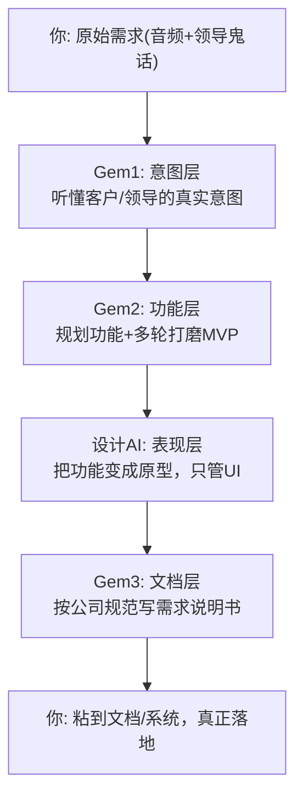
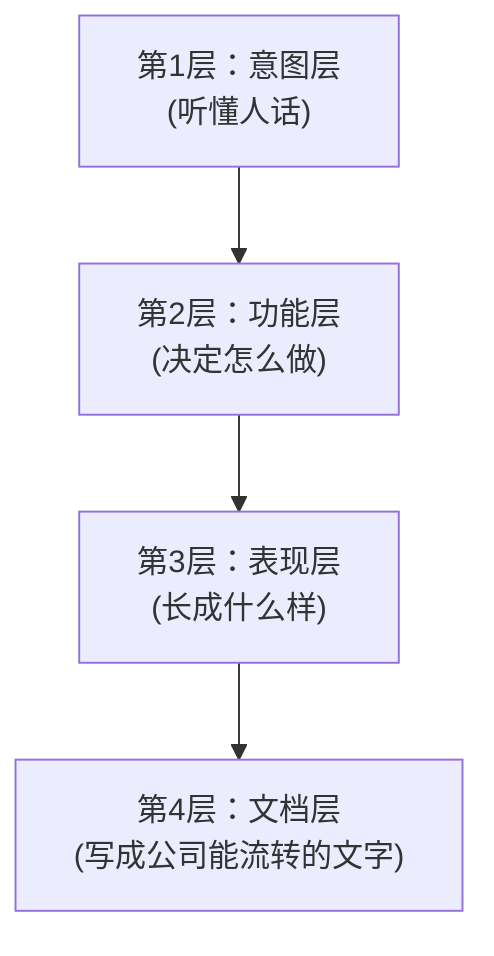

# 学习笔记 - 2025-12-22

## 1. 会话概览 (Session Overview)

- 日期: 2025-12-22
- 时长: ~60 分钟
- 主要主题:
  - 基于真实工作流的多智能体拆解：Gem1 / Gem2 / 设计AI / Gem3
  - 四层模型：意图层 → 功能层 → 表现层 → 文档层
  - C.1 路由与移交（Handoffs）：谁上场、带什么信息、不能带什么
  - 各层“升级 Checklist”：何时可以从一层跳到下一层

---

## 2. 核心交互记录 (Interaction Log)

### 主题 1: 发现“我其实已经在用多智能体，只是全靠手动”

#### 我的问题/场景 (My Question/Scenario)
最近有一条从“音频 + 领导模糊一句话”到“原型 + 公司规范需求文档”的完整需求流程，我隐约感觉自己一直在用一套固定的 AI 组合，但以前只是凭直觉在切换，不知道这是不是所谓的多智能体 Agent 流程。

#### 我的初始理解 (My Initial Understanding)
- [x] 我习惯让不同的 AI 干不同的事：
  - Gem1：听懂客户和领导的潜台词，帮我把“人话”解码成清晰目的；
  - Gem2：拿着目的去规划功能，多轮打磨找到 MVP 方案；
  - 设计AI：只画原型，不碰功能逻辑；
  - Gem3：看功能 + 原型，按公司格式写需求说明书。
- [x] 我一直在手动控制“这一轮找谁、要给他看哪些内容”，但没用过“多智能体”和“路由/移交”这种说法。
- [ ] 之前没有把这些步骤当成一条统一的 State Graph，只是觉得“顺着做就对了”。

#### 提供的解释 (Explanation Given)

**用 Agent 语言给这条链子命名：**

核心结论：

- 这已经是一条完整的**多智能体流水线**：每个 AI 是一个“角色清晰的智能体”；
- 你本人在做三件“系统级”的事：
  - 当 **Router（路由器）**：决定这一轮该轮到谁上场；
  - 当 **State 管理员**：决定每一棒看到什么、不看到什么；
  - 当 **顶层 Reviewer**：决定什么时候可以“升级”到下一层。

换句话说：
> 你已经在用一套完整的 Agent 编排，只是目前全靠手动直觉在 orchestrate（编排），没有把它写成显式规则或代码。

#### 理解检查 (Comprehension Checks)

- **问题(Q):** 用一句话概括“我现在已经在干的事”和“未来 Agent 系统帮我干的事”的差别？
- **我的回答(A):** 现在所有“找谁、给什么、什么时候进下一阶段”全在我脑子里；未来如果写成 Agent 系统，这些决策会变成显式的路由规则、状态字段和移交协议，系统可以部分替我做这些判断。
- **标记:** ✓ 正确
- **洞察:** 现在这套流程已经是“业务侧的草稿版架构设计”，后续只需要把这些直觉固化成规则，而不是重新发明一条新链路。
- **理解程度:** 良好

---

### 主题 2: 四层模型 - 先听懂，再规划，再画，再写

#### 我的问题/场景 (My Question/Scenario)
之前感觉一大堆名词（ReAct、State Graph、Handoffs、多智能体）有点散，这次想要一个“足够简单、能装下我真实工作流”的统一抽象，不想再靠死记硬背概念。

#### 我的初始理解 (My Initial Understanding)
- [x] 直觉上，我的工作总是从“听懂人话”开始，然后才是“想怎么做”、“长什么样”、“写成文档”；
- [ ] 但没把这几个阶段抽象成一个清晰的分层模型；
- [ ] 更没用这个模型去约束每一层应该负责什么、不该负责什么。

#### 提供的解释 (Explanation Given)

**四层小楼模型：**

- **第1层 意图层（Gem1）**：
  - 问题：他们到底想干嘛？为什么现在提？
  - 产物：`intent_decoded_summary`（客户意图 + 领导考量的潜台词解码）。
- **第2层 功能层（Gem2 + 风险审查AI）**：
  - 问题：要做哪些功能？MVP 只做哪一部分？
  - 产物：`feature_plan_mvp`（功能清单 + MVP 方案 + 关键假设）。
- **第3层 表现层（设计AI）**：
  - 问题：这些功能在界面上怎么呈现？路径怎么走？
  - 产物：`ui_prototype`（原型）。
- **第4层 文档层（Gem3）**：
  - 问题：怎么用公司看得懂、能审批、能落地的格式，把上面三层讲清楚？
  - 产物：`prd_draft` / `prd_final`（需求说明书）。

一句话心智模型：
> 先听懂，再规划，再画，再写；每一层只对自己的产物负责，不跨层越权。

#### 理解检查 (Comprehension Checks)

- **问题(Q):** 如果我在“意图还没搞清楚”的情况下就催自己进功能/原型，会带来什么典型问题？
- **我的回答(A):** 功能层会在“假想的目的”上乱设计，后面容易发现方向错了，只能推翻重来；很多返工其实是因为第一层没说清楚“为什么要做”。
- **标记:** ✓ 正确
- **洞察:** 以后看到返工，不光要怪“需求没想清楚”，还可以定位是“哪一层没毕业就被硬拉进下一层”。
- **理解程度:** 良好

---

### 主题 3: C.1 路由 + 移交 - 谁上场，带什么，不能带什么

#### 我的问题/场景 (My Question/Scenario)
在实际使用 Gem1/Gem2/设计AI/Gem3 时，我一直在手动控制：这一轮找谁、给他看哪些内容、哪些信息要刻意屏蔽（比如不让上一轮 AI 夹带设计意见）。想把这种“手感”提升为一套可复用的路由和移交心智模型。

#### 我的初始理解 (My Initial Understanding)
- [x] 习惯给不同 AI 严格划定边界：谁负责听懂、谁负责功能、谁负责画、谁负责写；
- [x] 有很强的信息隔离意识：上一轮 AI 只能传功能讨论结果摘要，不能给后面的设计AI灌输自己的设计观点；
- [ ] 还没有一套“显式的移交规则表”，完全靠经验记忆。

#### 提供的解释 (Explanation Given)

**1）路由（Router）视角：这一棒轮到谁？**

- 音频 + 领导鬼话 → 必须先上 **Gem1（意图层）**；
- 意图解码完成 → 才能上 **Gem2（功能层）** 做规划；
- 功能打磨到 MVP → 视情况上 **风险审查AI**（只看功能，不看 UI）；
- 功能 + 风险 OK → 才能上 **设计AI（表现层）** 画原型；
- 原型稳定 → 才上 **Gem3（文档层）** 出需求说明书。

**2）移交（Handoffs）视角：这一棒带什么，不带什么？**

- 你 → Gem1：
  - 带：`raw_audio` + `raw_leader_request`；
  - 不带：任何功能方案，避免 Gem1 越权设计。
- Gem1 → Gem2：
  - 带：`intent_decoded_summary`（客户 + 领导的潜台词解码）；
  - 不带：Gem1 自己的功能想法，只负责“听懂人话”。
- 你/Gem1 → Gem2：
  - 带：你整理好的 `planning_prompt`；
  - 注意：不要把你心里的成品方案写死，保留 Gem2 探索空间。
- Gem2 → 风险审查AI：
  - 带：`feature_plan_mvp` + `planning_assumptions` + `intent_decoded_summary`；
  - 不带：UI 想法，风险审查只看“做这个功能会不会踩坑”。
- 功能层 → 设计AI：
  - 带：`feature_plan_mvp` + `intent_decoded_summary` + `design_constraints`；
  - 禁止：传前面 AI 的 UI 细节建议，避免设计AI被“绑住手脚”。
- 设计AI → Gem3：
  - 带：`ui_prototype` + `feature_plan_mvp`；
  - 注意：一般不让 Gem3看设计AI的长篇解释，避免文档语言变成“设计复盘稿”。

**3）对话剧本心智模型：两句话记住每一棒**

- 我现在在想啥？ → 决定“路由到谁”。
- 我给他啥？ → 决定“移交哪些字段”。

#### 理解检查 (Comprehension Checks)

- **问题(Q):** 在“功能层 → 设计层”的移交中，如果只是一味减少信息，而不给约束声明，会发生什么？
- **我的回答(A):** 设计AI 信息太少会自己脑补，反而更爱乱发挥；比起“饿它”，更重要的是用约束说明告诉它“吃什么、不能吃什么”。
- **标记:** ✓ 正确
- **洞察:** 输入 = 数据字段 + 规则字段，约束说明本身就是 State 的一部分。
- **理解程度:** 良好

---

### 主题 4: 各层“升级 Checklist” - 何时可以进下一层

#### 我的问题/场景 (My Question/Scenario)
我经常会在“感觉差不多了”时往下一步推，但这个“差不多”全靠直觉，希望把它变成一套简单的 Checklist，这样以后可以：
- 复盘：“是不是跳太早了”；
- 甚至有一天交给 Agent 自己判断，减少我盯流程的时间。

#### 提供的解释 (Explanation Given)

**1）意图层 → 功能层（Gem1 → Gem2）**

满足以下条件，才算“意图层毕业”：

- 谁要什么已经拆开：客户想要什么、领导真正关心什么，以及两者关系（冲突/包含/同向）；
- 至少有一句靠谱的“为什么现在做”（营收/体验/合规/内部对齐…）；
- 问题边界有粗框：本次明确“不做什么”；
- 你自己读一遍“潜台词解码”，不会本能地想再追问 Gem1。

> 心里测试：如果我敢把这段解码说明直接丢给一个新人 PM，让他去做功能规划，那就可以进 Gem2 了。

**2）功能层内部：ReAct 什么时候停（Gem2 自我收敛）**

把功能规划当成一张“三格卡片”：

- 功能列表格：每个功能都能回答“服务谁/在什么场景触发/改变了什么”；
- 流程闭环格：用户从进入到完成，一句话能讲顺，没有“凭空出现或消失”的输入输出；
- MVP 收敛格：有明确“这一版只上 X、Y，Z 暂缓”的取舍说明。

当这三格都能说得过去，而且你再看一轮挑不出“硬伤”，就可以让 ReAct 停下来，并在 prompt 里显式加标记：`mvp_ready = true`。

**3）功能层 → 表现层（Gem2 → 设计AI）**

可以进设计AI的条件：

- 你大致知道每个关键功能会落在哪一类页面/入口；
- 已经写清楚“设计AI不能改功能逻辑/不能私自加需求”的约束说明；
- 心态上接受“此时 UI 再丑一点没关系，关键是表达清楚功能和路径”。

> 心里测试：如果此时让我手画框线给设计师，他也能大致画出来，那就可以进设计AI。

**4）表现层 → 文档层（设计AI → Gem3）**

可以进 Gem3 的条件：

- 原型不会再大改整体结构，只剩细节微调；
- 你已经能用自己的话，把这个原型讲给一个完全没跟进过这个项目的人听而不卡壳；
- 很清楚文档要解决的是“能审批、能排期、能验收”，而不是“说服自己这个想法真酷”。

> 心里测试：如果产品评审会明天开，我敢拿这版原型当主讲材料，那就可以进文档层。

#### 理解检查 (Comprehension Checks)

- **问题(Q):** 如果某一层没毕业就被我硬拉进下一层，最常见的后果是什么？
- **我的回答(A):** 要么后面的人做着做着发现方向不对，只能返工；要么产物看起来“做完了”，但没人敢真用，因为底层“为什么要做”没被说清楚。
- **标记:** ✓ 正确
- **洞察:** 以后看到返工或“做完没人敢用”的需求，可以沿着四层模型往上追：到底是意图没毕业，还是功能没毕业。
- **理解程度:** 良好

---

## 3. 识别出的知识盲区与下次行动项

### 知识盲区表

| 主题 | 严重程度 | 备注 | 解决状态 |
|------|--------|------|--------|
| 自我审查（Reflection）的审稿标准设计 | 中 | 已知道需要"新对话/新AI"+审稿Checklist，但 Checklist 具体条目和分级标准还未完全定型 | 部分解决 |
| ReAct 循环的自动终止条件 | 中 | 今天已经梳理出人类侧的三格卡片标准，但还没有设计成“可被模型自用”的结构化检查流程 | 未解决 |
| 移交（Handoff）时的信息传递策略 | 低 | 已有清晰直觉和对白名单/黑名单意识，但还没在真实系统中以配置/协议形式固化 | 未解决 |

### 🎯 针对上述盲区的后续行动

- [ ] 把"审稿Checklist"、"ReAct终止Checklist"、"Handoff字段白名单"三块，尝试写成可以直接塞进 prompt 的结构化模版；
- [ ] 选一条真实需求（如这次音频需求），用今天的四层模型+Checklist做一次"从头到尾的回放和标注"；
- [ ] 观察哪几个判断还严重依赖“直觉”，作为下一阶段需要优先"显式化"的规则。

---

## 4. 本次掌握的主题总结 (Topics Mastered Today)

| 主题 | 信心指数 | 备注 | 来源 |
|------|--------|------|------|
| 四层模型：意图→功能→表现→文档 | 良好 | 能用"先听懂，再规划，再画，再写"解释自己所有需求流程，并清楚每一层的产物和边界 | 主题 2 |
| 多智能体协作：Gem1/Gem2/设计AI/Gem3 的角色分工 | 良好 | 能用角色视角解释每个智能体负责哪一层、产出什么、绝对不该做什么 | 主题 1、2、3 |
| 路由与移交（C.1 Handoffs）的直觉规则 | 良好 | 形成"这一轮我在想啥/我要给他啥"的对话剧本心智模型，并能列出关键的字段白名单/黑名单 | 主题 3 |
| 各层升级 Checklist（何时进入下一层） | 良好 | 能用一套简单问题判断意图层/功能层/表现层/文档层是否"毕业"，并据此解释返工的根因 | 主题 4 |

---

## 5. 下次会话开始点 (Resume Point)

- 可以从任一具体需求出发，用今天的四层模型 + Checklist 做一次完整回放；
- 或者开始把其中一块（例如 ReAct 终止条件 或 Handoff 字段白名单）尝试写成真正可以塞进系统/框架的配置模版。
