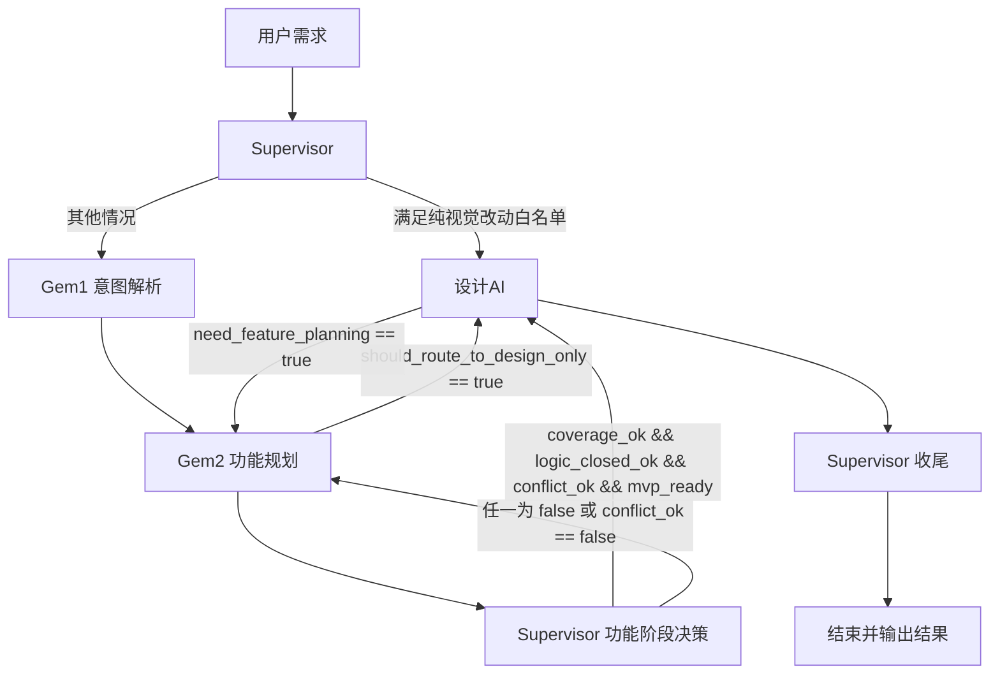

# 学习笔记 - 2025-12-24

## 1. 会话概览 (Session Overview)

- 日期: 2025-12-24
- 时长: ~80 分钟
- 主要主题:
  - 学习 C.2 Supervisor（监督者模式）与 Router Agent 心智模型
  - 基于真实工作流（Gem1/Gem2/设计AI/Gem3）设计路由与纠错规则
  - 提炼可落地的 Supervisor system prompt 模板与决策流程图

---

## 2. 核心交互记录 (Interaction Log)

### 主题 1: Supervisor vs Handoffs 的区别与适用场景

#### 我的问题/场景 (My Question/Scenario)
在已经掌握 C.1 Handoffs（多智能体路由与移交）的基础上，希望进一步理解 C.2 Supervisor（监督者模式），并弄清楚：
- Supervisor 和 Handoffs 在架构上的本质区别是什么？
- 在自己的 Gem1/Gem2/设计AI/Gem3 工作流里，哪些场景适合引入 Supervisor？

#### 我的初始理解 (My Initial Understanding)
- [✓] 直觉认为：Handoffs 更像"按部就班"的固定流程，Supervisor 更像"按需选择路径"的动态调度。
- [✓] 能给出具体例子：领导只改首页配色的需求，其实不需要走 Gem1/Gem2，直接丢给设计AI即可。
- [ ] 但还不清楚 Supervisor 在多轮流程中到底负责哪些决策，以及如何避免误判路由导致方向走偏。

#### 提供的解释 (Explanation Given)
- Handoffs 模式：
  - 更像"流水线"：A → B → C → D，路径在设计时就写死。
  - 适合每一步都必经且依赖关系清晰的线性流程。
- Supervisor 模式：
  - 更像"呼叫中心主管"或"工单调度系统"：根据当前任务类型、上下文、已有进展动态决定下一步派给谁。
  - 核心职责包括：
    - 路由决策（Routing）：决定下一步调用哪个 Agent。
    - 状态管理（State Tracking）：记录已经走过哪些阶段、拿到哪些输出。
    - 终止判断（Completion Check）：决定任务何时可以收工。
- 在你的场景里：
  - Handoffs 版链路：音频/文字需求 → Gem1 → Gem2 → 设计AI → Gem3。
  - Supervisor 版链路：
    - 新需求 → 先 Gem1，再 Gem2，再设计AI。
    - 仅 UI 微调 → 直接设计AI，甚至不需要 Gem3 文档。
    - 补写文档 → 可直接 Gem3，重用既有原型/功能规划。

#### 理解检查 (Comprehension Checks)

- **问题(Q1):** 用一句话概括 Supervisor 和 Handoffs 的核心区别？
- **我的回答(A1):** 一个是按部就班的固定流程，一个是按需选择适合路径的动态调度。
- **标记:** ✓ 正确
- **洞察:** 已能抓住本质：Handoffs = 固定路径，Supervisor = 动态路径选择。
- **理解程度:** 良好

- **问题(Q2):** 领导只改首页配色这种需求，在 Supervisor 模式下怎么处理更合理？
- **我的回答(A2):** 这种需求不需要经过 Gem1、Gem2，也不会体现在需求说明书里，直接交给设计AI设计一版就可以交差。
- **标记:** ✓ 正确
- **洞察:** 能自然把真实工作习惯映射到路由决策：纯视觉改动可直达设计AI。
- **理解程度:** 优秀

---

### 主题 2: Supervisor 的难点 —— 意图识别、多轮决策与边界

#### 我的问题/场景 (My Question/Scenario)
在理解了 Supervisor 的直觉后，意识到一个核心风险：
> 现在是用户原始需求直接交给 Supervisor 让它判断派给哪个 Gem。如果判错了，比如一个本来只要改 UI 的需求被误发给 Gem2，当成新功能规划，后面所有输出都可能跑偏。

希望弄清楚：
- Supervisor 最难的地方究竟是什么？
- 如何设计出"安全"的 Supervisor，既能走捷径，又不轻易走错路？

#### 我的初始理解 (My Initial Understanding)
- [✓] 直觉上觉得"意图识别"是最难的（入口分类错了，后面全错）。
- [ ] 但还没系统意识到：Supervisor 需要在整个多轮流程中反复决策，而不仅是入口判一次。
- [ ] 对"谁说了算"（Supervisor vs 各子 Agent）的边界还不清晰。

#### 提供的解释 (Explanation Given)
- 难点 1：入口难点 = 意图识别 + 任务分类。
  - 不只是看一句"你想干嘛"，而是要在很多细颗粒度任务中分类：新项目 / 小改动 / 纯 UI / 只补文档等。
  - 分类错了会导致：
    - 大需求被当成小改动 → 步骤不够，风险增大。
    - 小需求被当成大项目 → 流程太长，浪费时间和 Token。
- 难点 2：过程难点 = 多轮决策，而不是一次性决定。
  - Supervisor 不是只在第一步做路由决策，而是在每次拿到新结果时，都要决定下一步：
    - 继续补信息？
    - 进入下一层（功能 → 设计 → 文档）？
    - 还是回退到上一层？
- 难点 3：边界难点 = Supervisor 和下游 Agent 谁有最终决定权？
  - 如果 Supervisor 过软：谁说"可以了"就停，标准会混乱。
  - 如果 Supervisor 过硬：一味要求多轮验证，成本会爆炸。
  - 更好的设计是：让每个 Agent 暴露结构化"自检信号"，Supervisor 基于这些信号 + 全局规则做路由，而不是靠感觉拍脑袋。

#### 理解检查 (Comprehension Checks)

- **问题(Q):** 如果 Supervisor 把一个本来只要改 UI 的需求误发给 Gem2，当成新功能规划，会出现什么问题？
- **我的回答(A):** 路由判断错误会导致 Gem2 直接从功能角度展开设计，后续设计AI/Gem3 都跟着这个错误方向走，最后结果整体偏离了用户原始意图。
- **标记:** ✓ 正确
- **洞察:** 能清晰意识到"入口分流错"不是多走两步的问题，而是整个链路方向错。
- **理解程度:** 良好

---

### 主题 3: Supervisor 路由与纠错规则 —— 视觉白名单 + 功能自检信号

#### 我的问题/场景 (My Question/Scenario)
在理解难点之后，希望把自己的直觉规则固化下来，让 Supervisor 能够：
- 在"纯视觉改动"的场景下安全地走捷径，直接路由到设计AI；
- 在"功能/流程变更"的场景下，老老实实走 Gem1/Gem2；
- 在路由出现偏差时，能通过冲突识别和自检信号回退到 Gem2 修正。

#### 我的初始理解 (My Initial Understanding)
- [✓] 能给出直观规则：
  1. 当描述中只出现配色/排版/字号/布局、不出现"新增/删除某个功能"字眼时，直接转发给设计AI。
  2. Supervisor 在功能阶段应该检查：是否覆盖用户原始需求、产品逻辑是否闭环、是否与已有功能冲突。
- [ ] 但这两条还比较散，需要结构化成可以给 AI 实际执行的规则模板。

#### 提供的解释 (Explanation Given)

**1）视觉微调直达 DesignAI 的白名单规则**

- 触发条件（全部满足）：
  - 用户描述只涉及：
    - 配色 / 颜色风格
    - 排版 / 布局
    - 字号 / 间距
    - 视觉风格（科技感/大屏感等）
  - 且没有任何关于：
    - 新增/删除 功能/入口/模块/按钮/页面
    - 改流程/路径/步骤
    - 调整权限/业务规则
- 动作：
  - Supervisor 直接将需求派给设计AI，不调用 Gem1/Gem2。
  - 设计完成后，如果没有新的纠错信号，则可以结束本次任务。

**2）功能阶段的自检信号与放行条件**

- 要求 Gem2 输出以下自检信号：
  - `coverage_ok`：是否把用户原始需求都映射到功能上。
  - `logic_closed_ok`：功能和流程是否自洽闭环，没有"凭空出现"的输入/输出。
  - `conflict_ok`：是否与已有功能/体验无冲突。
  - `mvp_ready`：是否已经明确 V1 范围与取舍。
- Supervisor 的放行规则：
  - 若 `coverage_ok && logic_closed_ok && conflict_ok && mvp_ready` 全为 true：
    - 放行到设计AI（进入表现层）。
  - 否则：
    - 退回 Gem2，针对为 false 的项补强。
  - 特别地：
    - 若 `conflict_ok == false` → 视为"与已有功能有冲突"，必须退回 Gem2 修改，禁止进入设计AI。

**3）纠错机制：谁有权说"这路走错了"**

- Gem2 纠错：
  - 若 Gem2 发现这次需求本质上只是 UI 表达问题（功能不变），可以设置 `should_route_to_design_only = true`。
  - Supervisor 收到后，可将任务重新标记为"视觉改动为主"，直接路由到设计AI。
- 设计AI 纠错：
  - 若设计AI在绘制时发现涉及新增入口/改流程/改信息架构，可设置 `need_feature_planning = true`。
  - Supervisor 收到后，将任务转回 Gem2，让产品功能先想清楚，再继续设计。

#### 理解检查 (Comprehension Checks)

- **问题(Q1):** 什么时候可以放心跳过 Gem1/Gem2，直接把需求交给设计AI？
- **我的回答(A1):** 只有在我几乎能确定这是纯视觉改动、完全不动功能和流程的时候（只改配色/排版/字号/布局），才可以走这条直达路线；只要沾一点功能/流程的味道，一律走 Gem1/Gem2 正常链路。
- **标记:** ✓ 正确

- **问题(Q2):** 如果 `coverage_ok = true`、`logic_closed_ok = true`，但 `conflict_ok = false`，Supervisor 应该怎么做？
- **我的回答(A2):** 说明和现有功能/体验有冲突，不能直接进入设计AI，必须退回 Gem2 重新修改，让功能方案和既有系统对齐之后再放行。
- **标记:** ✓ 正确
- **洞察:** 能把"冲突回退"看作硬规则，而不是建议项。
- **理解程度:** 良好

#### 📊 本主题的流程图（Supervisor 路由与纠错）

---

### 补充：三类入口模式与两个典型场景

这部分是给“未来的我”看的，用来快速回忆：**这次进入 Supervisor 时，是该从 Gem1 开始，还是可以直接从 Gem2/设计AI 起步？** 以及在真实需求里，Supervisor 实际上是怎么一步步做决策的。

**三类入口（什么时候必须 Gem1，什么时候可以直接上 Gem2/设计AI）**

- **原始话术入口（raw_request）**  
  - 输入长相：领导/业务方的原话或录音转写，比如“你给我整一个电厂告警大屏”“首页太丑了，要看起来高级一点”这类自然语言。  
  - 特征：
    - 里面混着情绪、比喻、半句话（“高级一点”“一眼看到全局”“要有领导感”）
    - 没有拆成“谁要什么”“为什么现在做”“有哪些隐含红线/参考物”等结构化信息
  - 处理策略：
    - 必须先走 Gem1，一次性把潜台词、角色诉求、认知误区、参考物看中了什么等信息拆干净
    - Supervisor 把这一轮视为“把需求翻译成人话/产品脑图”的阶段，之后才允许 Gem2 介入

- **已解析意图入口（after_intent）**  
  - 输入长相：已经整理好的需求摘要/意图解析，例如：
    - 我自己写的需求 Brief（分点列清：谁要什么、为什么现在做、有哪些约束）
    - 上一轮 Gem1 的 `intent_decoded` 输出（已经把原话解构完毕）
  - 特征：
    - 不再是“原始倾诉”，而是“已经做过一轮结构化理解”的内容
    - 对“我要解决什么问题”已经有共识，只是还没展开成功能方案
  - 处理策略：
    - Supervisor 可以直接把当前状态标记为“after_gem1”，跳过再次调用 Gem1
    - 下一棒直接派给 Gem2，让它从功能清单、用户旅程、MVP 范围这些维度展开

- **纯视觉改动入口（visual_only）**  
  - 输入长相：只谈配色/排版/字号/布局/视觉风格的调整，例如：
    - “首页改成蓝色系，看起来高级一点”
    - “卡片之间的间距拉大一点，整体更轻松”
  - 负面特征（**必须不存在**）：
    - 不提“新增/删除某个功能/入口/模块/按钮/页面”
    - 不提“改流程/改路径/改步骤/改权限/改业务规则”等
  - 处理策略：
    - Supervisor 可以走一条“捷径路径”：不叫 Gem1/Gem2，直接路由到设计AI
    - 默认认为这是“在已有功能上的换皮/视觉强化”，不是产品逻辑层面的重构

**两个典型场景回放（带 Supervisor 决策旁白）**

- **案例 A：首页改成蓝色系（典型 visual_only）**  
  - 入口：  
    - 顶层 Router 先判定：这不是问“什么是蓝色系 UI”，而是要“改产品长相”，所以走“产品工作流”这条大路。  
  - Supervisor 第一次看：  
    - 只看到“改颜色/更高级”这类视觉诉求，看不到任何功能/流程/入口相关词汇 → 满足 visual_only 白名单。  
    - 决策：走 `visual_only` 入口，直接把任务派给设计AI。  
  - 设计AI 行动：  
    - 以当前首页为基准，重新设计一版蓝色系+更高级感的视觉方案，保证功能布局不变。  
  - 收尾：  
    - 如果这次输出你觉得“OK，可以发给领导看第一版”，Supervisor 就认为任务完成；如果你觉得还要多一轮风格迭代，本质上也是继续在设计AI这一层打磨，不会上升到 Gem2。

- **案例 B：电厂告警大屏（典型 raw_request）**  
  - 入口：  
    - 顶层 Router 判断：这是“做一个新功能视图”，属于产品工作流，不是简单查文档/改文案。  
  - Supervisor 第一次看：  
    - 需求里有“告警大屏”“一眼看全局”“能追到具体电厂和模型”等词，明显涉及：
      - 新的数据聚合方式
      - 新的导航/钻取路径
      - 新的指标与既有告警系统的关系  
    - 决策：这是典型 raw_request → 先交给 Gem1 做意图解析。  
  - Gem1 行动：  
    - 拆出“谁要什么”（领导 vs 运维）、“为什么现在做”（现有告警分散难汇报）、“参考物是什么”（比如友商的大屏）、“可能的认知误区”。  
  - Supervisor 第二次看：  
    - 有了一份结构化的 `intent_decoded`，此时可以认定“意图层已经完成”，于是派给 Gem2。  
  - Gem2 行动：  
    - 产出功能模块（总览区、电厂列表、单电厂详情…）、用户旅程（领导从全局视图钻到具体电厂）、MVP 范围（V1 只做线上环境+关键告警）、以及四个自检信号：`coverage_ok`、`logic_closed_ok`、`conflict_ok`、`mvp_ready`。  
  - Supervisor 第三次看：  
    - 如果四个自检信号全为 true → 放行到设计AI；如果 `conflict_ok == false`（比如和现有告警列表口径冲突）→ 打回 Gem2 要求修改方案。  
  - 后续：  
    - 当设计AI 画完大屏，如果在过程中发现“其实还缺一个告警确认/协同流程”等业务逻辑，也可以抬手给 Supervisor 一个 `need_feature_planning = true`，再次把球踢回 Gem2，避免 UI 自己瞎设计业务规则。

---

## 3. 识别出的知识盲区与下次行动项

### 知识盲区表

| 主题 | 严重程度 | 备注 | 解决状态 |
|------|--------|------|--------|
| Supervisor 在具体框架（如 LangGraph）中的节点/边实现方式 | 中 | 目前只在概念和规则层面清晰，还没有在真实框架里实现过 Supervisor 节点和路由逻辑 | 未解决 |
| Supervisor 与现有 RAG 系统的意图分流（检索/生成/改写等）如何融合 | 中 | 需要把今天的路由心智模型嫁接到已有的 RAG 意图识别与分流策略上 | 未解决 |

### 🎯 针对上述盲区的下次行动项

- [ ] **落地到具体框架：Supervisor 实现练习**
  - 选择一个熟悉的框架（优先 LangGraph），按照今天的规则设计一个最小可用的 Supervisor 节点。
  - 用简单的三 Agent 场景（Gem1/Gem2/DesignAI）模拟路由与回退。

- [ ] **与 RAG 意图分流整合**
  - 复盘现有 RAG 系统中的意图分类逻辑（检索回答 vs 总结 vs 改写 vs 任务分解）。
  - 思考在这些意图下，Supervisor 应该如何参与：哪些交给检索层，哪些交给多 Agent 编排层。

### 📋 行动项-盲区映射

| 行动项 | 对应盲区 | 优先级 |
|--------|--------|--------|
| Supervisor 实现练习 | Supervisor 在具体框架中的实现方式 | 高 |
| 与 RAG 意图分流整合 | Supervisor 与 RAG 系统一起工作的问题 | 中 |

---

## 4. 本次掌握的主题总结 (Topics Mastered Today)

| 主题 | 信心指数 | 备注 | 来源 |
|------|--------|------|------|
| Supervisor vs Handoffs 的本质区别 | 良好 | 能用"固定流程 vs 按需路径"概括两者差异，并能结合实际工作流举例说明 | 主题1 理解检查 |
| Supervisor 路由与纠错心智模型 | 良好 | 建立起"视觉白名单直达设计AI + 功能自检信号放行 + 冲突回退到Gem2 + 子Agent举手纠错"的一整套决策逻辑 | 主题2/3 理解检查 |
| Supervisor system prompt 设计能力 | 一般 | 能围绕角色设定/输入信号/路由规则/纠错机制写出一份可用的 Supervisor prompt 草稿，后续需要在真实框架中验证和迭代 | 主题3 Prompt 模板整理 |
