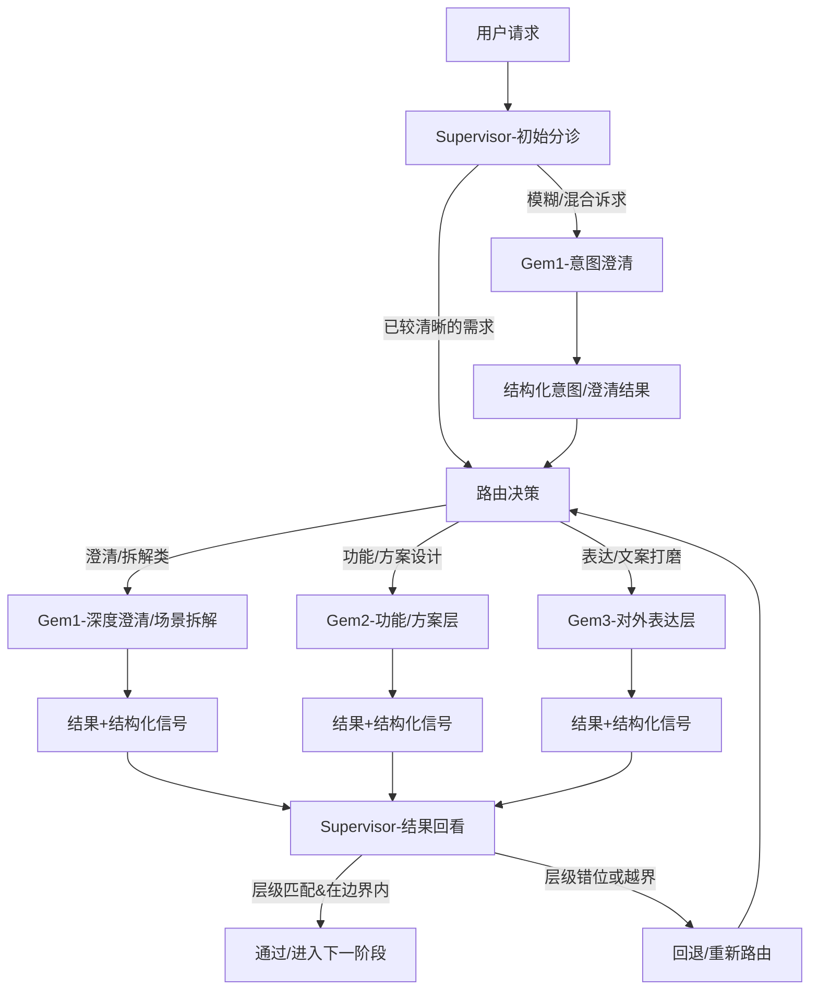
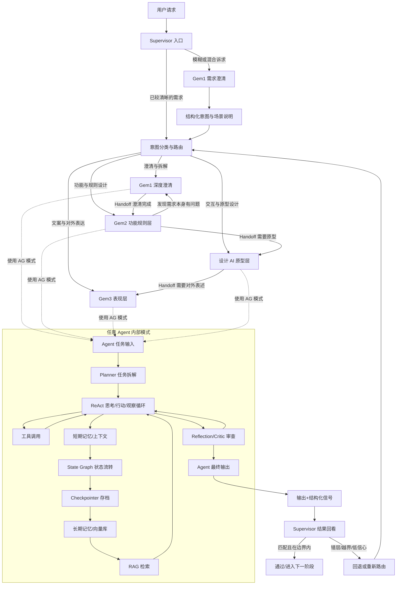

# 学习会话 - 2025-12-25

## 1. 会话概览 (Session Overview)

- 日期: 2025-12-25
- 时长: ~待定
- 主要主题:
  - C.2 Supervisor 意图识别与路由/回退

---

## 2. 核心交互记录 (Interaction Log)

### 主题 1: C.2 Supervisor 意图识别与路由/回退

#### 我的问题/场景 (My Question/Scenario)
1. 我觉得最难的是：怎么做意图识别，怎么把请求分配到对应的 Gem 上；
2. 怎么从各 Gem 的输出结果判断“适不适配”；
3. 能不能在发现不适配时把请求拉回来，再次分配给别的 Gem。

#### 我的初始理解 (My Initial Understanding)
用【✓/✗/空】清单列出：
- [ ] 还没有成体系的方法，只是有直觉上的“该交给谁”和“看着不太对时想改路由”。

#### 提供的解释 (Explanation Given)
Supervisor 和“审核”的分工可以理解为两层：
- Supervisor 更像“总编/主编台”：关心的是**这件事现在应该在哪一层被谁处理**，以及**当前结果是否跑错了层级/跑偏了目标**，核心动作是：路由 + 回退/重分配；
- 审核/Reviewer（比如 Reflection/Critic Agent）更像“具体版块的责任编辑”：在**已经确定的那一层里**，检查内容本身有没有逻辑漏洞、细节错误、表达问题。

所以之前你设计的“审核”更多是在某个 Gem 里做深度审稿，而这次我们说的 Supervisor，是在所有 Gem 之上的“分诊 + 调度 + 看是否要打回重分”的角色，它不一定自己看细节，但会看：
- 这次请求应该交给哪一类工作（澄清意图 / 设计功能 / 打磨对外表达）；
- 某个 Gem 的结果有没有越界到别的层（例如 Gem3 不该改业务逻辑，却动了规则）；
- 一旦发现层级错位，就把任务“拉回来”，重新路由给更合适的 Gem。

你刚才的两点回答，其实已经把这套机制踩到位了：
- 先用 Gem1 做“意图澄清”，让 Supervisor 在拿到更清晰的结构化意图后再做分配；
- 对 Gem2 的结果，用“有没有包含额外功能”作为回退触发条件，这是在用**功能边界**来做结果适配性判断。

#### 理解检查 (Comprehension Checks)

- **问题(Q1):** 输入是模糊诉求（“这个规则里有几条我感觉不太对，但说不出来哪儿怪”）时，应该交给哪个 Gem？Supervisor 该怎么澄清意图再路由？
- **我的回答(A1):** 先交给 Gem1 帮忙看用户到底想做什么，由 Gem1 产出更清晰的结果/结构化意图，再由 Supervisor 基于这个结果重新分配：如果是新需求就走 Gem2/原型 AI，如果不是就走各自正常流程。
- **标记:** ✓ 基本正确（已经把 Gem1 当作“意图澄清前置 Agent”，Supervisor 负责“决定是否再分配”）。
- **洞察:** 你已经自然地把“意图识别”拆成了两步：先用专门的澄清型 Agent（Gem1）把问题说清楚，再做正式路由，而不是让 Supervisor 在一堆含糊描述上硬猜。
- **理解程度:** 良好

- **问题(Q2):** 如果本来只希望 Gem2 在既有功能边界内设计/调整方案，结果它输出的内容里包含了“功能以外的功能”，Supervisor 应该用什么信号判断“这次处理越界了，需要打回去”？
- **我的回答(A2):** 看 Gem2 的输出是否包含它原本负责的功能之外的功能，如果有，就打回去。
- **标记:** △ 部分正确（抓住了“新增/扩展功能”这一条，但还可以再加上：是否删掉了必要功能、是否改变了原有约束边界等维度）。
- **洞察:** 你已经用“功能边界”作为判断标准，这是非常好的起点；下一步只需要把“越界”的几种典型方式列成 checklist，就能让 Supervisor 更稳地自动识别。
- **理解程度:** 一般 ↗（有清晰直觉，结构化程度还可以再增强一层）

#### 📊 本主题的流程图（若有）

📝 说明：
- Supervisor 在入口只判断“是否需要先走 Gem1 做意图澄清”，不会一次性决定所有后续步骤；
- 意图澄清后，正式路由到 Gem1/Gem2/Gem3 的决策点是 `R1`；
- 所有 Gem 输出必须带结构化信号，方便 `V` 节点做“是否越界/是否需要回退”的判断；
- 回退后回到 `R1`，而不是简单重跑同一个 Gem，这样才允许“换一个 Gem 处理同一问题”。

📝 说明（全局总览图）：
- 上半部分是 Supervisor + Gem1/Gem2/Gem3/设计 AI 的路由与移交关系；
- 中间 `AG` 子图是任意单个 Agent 内部的 ReAct + Planner + Reflection + 记忆/状态管理模式；
- 下部的 Handoff 边展示了“从澄清 → 功能 → 原型 → 表达”以及从中途发现问题后回到 Gem1 重新澄清的路径。

### Supervisor 心智速查卡 (Cheat Sheet)

#### 一、什么时候**必须先走 Gem1（需求澄清 Agent）**？

- **特征 1：语句模糊/混合多层诉求**
  - 一句话里同时出现“愿景 + 痛点 + 模糊方案”（例如：既说“有点乱”，又说“想简单”，但没说是规则还是文案）。
  - 处理策略：先让 Gem1 产出 `场景 + 痛点 + 诉求 + 期望输出形态` 的结构化描述，再交给 R1 正式路由。

- **特征 2：你自己也说不清“这是功能改造还是表达优化”**
  - 典型心声：“总觉得怪，但说不出来哪儿怪”。
  - 处理策略：Gem1 提一组澄清问题（Q1/Q2/Q3：改什么层、要什么形态、要不要动边界），帮你把意图定层级。

- **特征 3：潜在会动“规则/权限/风控”这类高风险区域**
  - 一提就是“权限太乱”“风控太重/太轻”，但没说是否要改现有边界。
  - 处理策略：先用 Gem1 明确：“这次是要在原边界内调优，还是允许提新边界方案（提案≠默认执行）”。

#### 二、Supervisor 结果回看的**三大越界信号**

- **信号 1：功能范围被“扩展”了**
  - 新增了原需求里从没提过的核心功能，或把“可选建议”写成“必做功能”。
  - 示例：你只想“加一个只读角色”，它顺带重塑整个角色体系。

- **信号 2：原有关键功能/结构被“弱化/删改”了**
  - 原始需求里 A/B/C 是硬性前提，结果输出里 B 被模糊带过甚至消失；
  - 或者原有角色/流程被拆分、合并，却没有在需求中被授权这么做。

- **信号 3：约束/边界被“悄悄改写”了**
  - 安全/合规/权限等边界被放宽（例如审批权从负责人挪到运营）；
  - 成本/冷却时间/打磨轮次等资源边界被无声扩张。

▶︎ 一旦命中任意一条，Supervisor 不直接通过，而是：
- 标记为“功能层越界候选”；
- 决定是：退回 Gem2 收窄边界，还是升级为“提案 + 人工决策”，或回 Gem1 重审意图。

#### 三、Supervisor vs Reviewer（审核 Agent）的分工

- **Supervisor（总编/主编台）关注：**
  - 这次工作**是不是进错楼层/进错部门**（Gem1/Gem2/Gem3/设计 AI 是否选对）；
  - 当前输出是否在**正确层级内完成了正确类型的事情**（例如：Gem3 有没有越界改业务逻辑）；
  - 是否需要**回退/重路由/升级人工决策**。

- **Reviewer / Critic（审核 Agent）关注：**
  - 在当前楼层里，这篇“稿子”是否**逻辑自洽、细节正确、边角 case 覆盖充分**；
  - 是否违背原始需求里的关键约束、是否存在明显漏洞或自相矛盾；
  - 是否需要再走一轮 ReAct/Reflection 打磨，**但不决定换不换楼层/换不换 Agent**。

- **协同原则：**
  - Supervisor 先判楼层 & 分工是否对 → 再交给 Reviewer 做层内深度审查；
  - 功能边界 OK 但表述不清 → Supervisor 把活交给 Gem3，而不是再退回 Gem2。

#### 四、防止“打回打到死”的终止/升级条件

- **终止条件示例：**
  - 同一主题在 Supervisor 层被回退 ≥ 3 次；
  - 多次修改后，方案在结构/边界上几乎无实质变化，只剩风格/措辞拉扯；
  - Reflection 已经反思多轮，仍然只能做局部微调，无法给出新的决策依据。

- **处理策略：**
  - Supervisor 触发“升级”：
    - 要么重写 Planner（重新拆解问题，承认原拆解有问题）；
    - 要么终止自动来回，标记为“需要人工拍板/更高层意图重审”。

- **落点建议：**
  - 终止/升级逻辑放在 Supervisor 层实现，利用其**全局视角**观察“总轮次 & 改动幅度”；
  - Agent 内部（Reflection）也可以自报“我在原地打转了”，但是否停机/升级由 Supervisor 决定。

#### 五、实战使用顺序（给自己看的小提示）

1. 收到一句话/一段话，先问：**要不要 Gem1 澄清？**（模糊/混合/高风险 → 必须先走）；
2. 拿到 Gem1 的结构化意图后，在 R1 做正式路由：Gem1 深挖 / Gem2 功能 / Gem3 表达 / 设计 AI；
3. 要求每个 Gem 输出时都附带**结构化信号**（本次涉及哪些功能、有没有新增/删改、是否触边界）；
4. 在 V 节点用“三大越界信号”扫一遍，决定：通过 / 回退给哪个 Gem / 升级人工；
5. 监控“回退轮次 + 改动幅度”，触发终止/升级，防止 Supervisor 自己也变成死循环。

---

## 3. 识别出的知识盲区与下次行动项

### 知识盲区表

| 主题 | 严重程度 | 备注 | 解决状态 |
|------|--------|------|--------|
| Supervisor 在具体框架（如 LangGraph）中的节点/边实现方式 | 中 | 今天主要在概念层梳理 Supervisor 流程与状态图，还没有落到具体 LangGraph/LangChain 节点/边与 Checkpointer 配置 | 未解决 |
| Supervisor 与现有 RAG 意图分流（检索/生成/改写等）如何集成 | 中 | 已有 Supervisor 路由心智，但还没和现有 RAG 意图识别/路由策略整合，不清楚顶层 Router 如何与 RAG 协作 | 未解决 |
| Supervisor Prompt 模板与 Gem1/Gem2/Gem3 Prompt 套件固化方式 | 低 | 今天明确了 Supervisor 职责边界与回退心智，但还没整理对应的 Prompt 套件，无法一键落地到具体项目 | 未解决 |

### 🎯 针对上述盲区的下次行动项

- [ ] **落地 Supervisor 在具体框架（LangGraph 等）中的实现方式**
  - 阅读 LangGraph/LangChain 中关于 Router/State Graph/Checkpointer 的官方文档与示例
  - 以 EnergyAI 工作流为例，画一版对应的 LangGraph 节点/边草图，标出 Supervisor 节点与路由边

- [ ] **设计 Supervisor 与现有 RAG 意图分流的协同策略**
  - 梳理当前 RAG 意图分类（检索/生成/改写等）的规则与入口
  - 设计一版“RAG Router + Supervisor Router”的协同流程，明确哪些意图只走 RAG、哪些需要进入多 Agent 工作流

- [ ] **整理 Supervisor + Gem1/Gem2/Gem3 Prompt 套件**
  - 将今天的 Supervisor 心智速查卡压缩为一段可复用的 Supervisor Prompt 描述
  - 起草 Gem1/Gem2/Gem3 的角色说明与输入输出约定，形成第一版多 Agent Prompt 模板

### 📋 行动项-盲区映射

| 行动项 | 对应盲区 | 优先级 |
|--------|--------|--------|
| 落地 Supervisor 在具体框架中的实现方式 | Supervisor 在具体框架（如 LangGraph）中的节点/边实现方式 | 高 |
| 设计 Supervisor 与 RAG 意图分流协同策略 | Supervisor 与现有 RAG 意图分流（检索/生成/改写等）如何集成 | 中 |
| 整理 Supervisor + Gem1/Gem2/Gem3 Prompt 套件 | Supervisor Prompt 模板与 Gem1/Gem2/Gem3 Prompt 套件固化方式 | 中 |

---

## 4. 本次掌握的主题总结 (Topics Mastered Today)

| 主题 | 信心指数 | 备注 | 来源 |
|------|--------|------|------|
| C.2 Supervisor 监督者模式（意图识别与路由/回退） | 良好 | 能区分 Supervisor 与审核 Agent 的职责边界，掌握“先 Gem1 澄清 → R1 路由 → V 结果回看 + 回退/重路由”的完整心智，并能用真实 B 端需求（助手发布/公司级模板）走完一条链路 | 主题 1 理解检查 |
