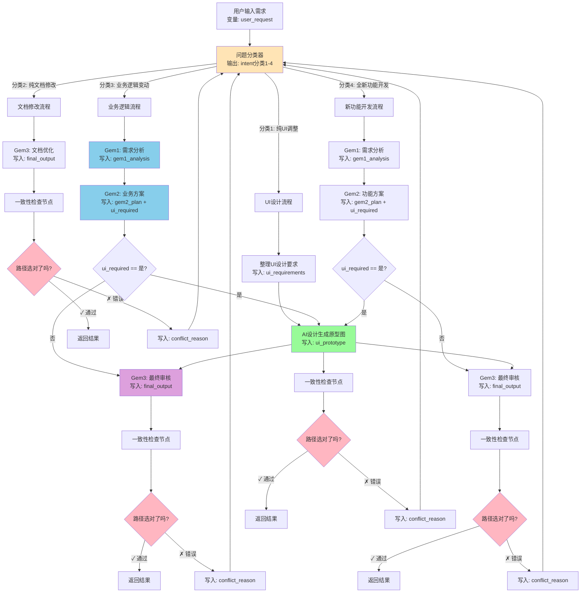

## 1. 会话概览 (Session Overview)

- 日期: 2026-01-05
- 时长: ~2 小时（上午理论学习 + 下午 Dify 实践讨论）
- 主要主题:
  - B.2 Plan-and-Solve 任务规划心智模型（结合 Supervisor）
  - D.2 State Graph 状态图心智模型（游戏存档 / 版本历史类比）
  - 实践工具选择：N8N vs Dify（低代码流程编排）
  - Dify 实战：搭建带冲突回退的 4 分类 Supervisor 工作流

---

## 2. 核心交互记录 (Interaction Log)

### 主题 1: Planner / Plan-and-Solve 与 Supervisor 的关系

#### 我的问题/场景 (My Question/Scenario)
- 直觉上觉得自己在 Supervisor 里是“提前知道整个流程”的，但不确定这是不是所谓的 Planner。
- 想搞清楚：Supervisor 这种“先选路径再调 Agent”的做法，算不算 Plan-and-Solve？

#### 我的初始理解 (My Initial Understanding)
- [✓] 正确认为: Supervisor 更像“决定谁来做事”的人，而不是亲自执行的人。
- [✓] 正确认为: 自己在设计 Gem1/Gem2/设计AI/Gem3 时，心里是有一张固定流程图的。
- [✗] 错误认为: Planner 可能是一个“更复杂的神秘东西”，和自己现在做的路由不太一样。
- [ ] 还没想清楚: Planner 和 ReAct 在什么场景下分别更合适。

#### 提供的解释 (Explanation Given)
- Planner（Plan-and-Solve）本质是：**先把任务拆解成一串有依赖关系的步骤（像路线图/DAG），再按图执行**，而不是边走边想。
- 你的 Supervisor 设计（根据意图选择 Gem1→Gem2→Gem3 或 Gem1→设计AI→Gem3 等）就是一种 **“预设路径选择型 Planner”**：不是每次从零生成计划，而是在几条稳定路径中选择最合适的一条。
- 标准 Planner 更偏向“动态生成计划”，而你的做法偏向“预先定义几条合理路径”，在可预测性、可调试性和成本上更适合真实业务。
- ReAct 更像“边观察边决定下一步”，适合步骤不确定、需要高度灵活的场景；Planner 适合步骤较清晰、有明显依赖关系的复杂任务（例如自动生成周报）。

#### 理解检查 (Comprehension Checks)
- **问题(Q):** 你的 Supervisor 设计，本质上更接近 ReAct 还是 Planner？
- **我的回答(A):** 更像 Planner，因为我是提前就知道完整流程，再决定走哪条路线。
- **标记:** ✓ 正确
- **洞察:** 自己之前已经在用 Planner 思维，只是没有给它起名字；Supervisor 其实就是一个“带预设路径的 Planner + Router”。
- **理解程度:** 良好

---

### 主题 2: State Graph 状态图心智模型（不含代码）

#### 我的问题/场景 (My Question/Scenario)
- 想理解 State Graph、State、Node、Edge 这些概念，但不想/不能通过代码来理解。
- 关心的问题：如果以后要在 LangGraph 或可视化工具里落地 Supervisor，**状态到底是什么、在什么地方被更新、怎么回退**？

#### 我的初始理解 (My Initial Understanding)
- [✓] 正确认为: 在多 Agent 流程里，总会有一份“当前进度/上下文”的东西在不同节点之间流转。
- [✗] 错误认为: 状态就像一个被反复擦写的白板，每个节点直接在上面改。
- [ ] 还没想清楚: 为什么大家老强调“不可变状态”“Checkpointer 存档”这些概念。

#### 提供的解释 (Explanation Given)
- 用 RPG 游戏类比：State = 游戏存档，Node = 一个个关卡/场景，Edge = 关卡之间的路径；每过一关就会产生一个新的存档版本，而不是在同一存档上反复擦写。
- 在 Supervisor 场景里，State 可以包含：用户原始需求、意图（intent）、选中的路径、各个 Agent 的中间产出、是否需要回退、最终输出等——本质是一份“流程档案 + 当前进度”。
- 每个“节点”（如 Supervisor、Gem1、Gem2、设计AI、Gem3）做的事，就是：**读一版状态 → 做一点事 → 产生一版“更新后的状态”**。
- 不直接“原地修改状态”，而是像“版本化需求文档 / 多个游戏存档”那样，每一步留下一份新版本，方便回退、审计和重放，这就是 State Graph + Checkpointer 的核心价值。

#### 理解检查 (Comprehension Checks)
- **问题(Q):** 在你的 Supervisor 流程里，如果要支持“冲突回退”，应该回到哪一步的“存档”比较合理？
- **我的回答(A):** 应该回到 Supervisor 做路由决策之前/之时那一步，而不是整个流程最开始，这样只需要重新选路径，不用重新问需求。
- **标记:** △ 部分正确（方向对，但回退策略可以根据成本/风险再细分：比如只回退到 Gem2 前、还是重新走 Gem1）。
- **洞察:** 回退不是“重来一切”，而是在“关键决策点”建立存档；State Graph 的设计重点是：**哪些节点前后要有“可回退的检查点”。**
- **理解程度:** 一般

---

### 主题 3: 实践工具选择（N8N vs Dify vs 代码）

#### 我的问题/场景 (My Question/Scenario)
- 不会/不想写代码，希望通过 N8N、Dify 这类低代码工具来实践 Agent 流程。
- 想确认：如果我用不上 N8N（不习惯），直接用 Dify 来做这些 Planner / State Graph 思路的实践，够不够用？会不会“学不到底层”？

#### 我的初始理解 (My Initial Understanding)
- [✓] 正确认为: N8N / Dify 这种工具本质是“可视化流程编排”，和 State Graph 很像。
- [✗] 错误认为: 不写代码就学不到“底层的东西”。
- [ ] 还没想清楚: Dify 这种平台在表达 Planner / State 这类设计时，有哪些天然限制和适用边界。

#### 提供的解释 (Explanation Given)
- 对你来说，“底层”更多指的是：**任务怎么拆、状态怎么记、异常怎么兜、版本怎么回退**，而不是具体代码语法；这一层完全可以用白板、流程图、低代码工具来掌握。
- N8N / Dify 这类工具，其实就是把 State Graph 变成“节点方块 + 连线 + 流程变量”的界面：节点 = Node，连线 = Edge，流程变量/上下文 = State。
- 你目前非常适合走“两条腿路线”：**用 Dify 做可视化实践（把 Supervisor 流程搭出来），用脑图/流程图巩固 ReAct / Planner / State Graph 的心智模型**，暂时不碰代码也完全没问题。
- 真正需要代码的那一层，更偏“工程落地”和“框架细节”；而你当前的学习目标是把 Agent 架构和决策思路吃透，这是可以独立完成的。

#### 理解检查 (Comprehension Checks)
- **问题(Q):** 如果只用 Dify 这类工具，你觉得自己在“底层理解”上最想保证哪一块不被偷懒？
- **我的回答(A):** 至少要自己设计清楚：每个节点负责什么、状态里要记哪些字段、失败/冲突时回到哪一个节点重新决策。
- **标记:** ✓ 正确
- **洞察:** 工具只是“画出来、跑起来”的壳，真正的底层是：**我自己对流程、状态、回退规则的设计决策。**
- **理解程度:** 良好

---

### 主题 4: ReAct + Planner + State Graph 的混合用法与 Dify 实战蓝图

#### 我的问题/场景 (My Question/Scenario)
- 现实里的需求流转，不是纯 ReAct、也不是纯 Planner，更像两者 + 状态管理的组合：先定大路线，再根据执行中的反馈做微调和回退。
- 想要一份可以直接映射到 Dify 工作流的“心智蓝图”，方便后面搭建自己的 Supervisor 多 Agent 流程。

#### 提供的解释 (Explanation Given)
- 在真实系统中，一个成熟的 Agent 流程往往是：**Planner 决定大致路线 → ReAct 在每个关键步骤内做细节探索/重试 → State Graph 负责记录所有中间状态和回退点**。
- 以“需求处理助手”为例：Planner/Supervisor 先决定是走“功能改动”线还是“UI 调整”线，具体到每条线上，内部可以用 ReAct 思路（反复查资料/重写方案），但所有关键节点（意图判断、方案确认、最终审核）前后都要有“状态存档”，以便发现冲突时回退到合适的检查点。
- 混合模式的核心不是“多高大上的算法”，而是：**在什么层级用规划（大步子），在什么层级用循环探索（小碎步），以及在哪些地方必须留存档（State + Checkpoint）。**
- 在 Dify 里，这三者可以对应为：上层用“流程编排/工作流”画出主路径（Planner），节点内部通过 LLM 提示词控制“小范围 ReAct 式重试/自检”，并在关键节点把重要字段写回“对话/工作流变量”（State），必要时通过条件分支实现“回到某个节点重跑”。

#### 一个面向 Dify 的结构化心智图（文字版）
- **层级 1：流程主干（Planner / Supervisor）**
  - 节点示例：入口 → 意图判断 → 分支（功能改动 / UI 调整 / 纯文档）→ 最终审核
  - 你的决策：有哪些稳定路径？每条路径上必须经过哪些节点？
- **层级 2：节点内部行为（局部 ReAct）**
  - 节点示例：在“需求分析节点”里，可以允许模型：多问几轮澄清、对自己的理解打分、不满足就重写。
  - 你的决策：在哪些节点值得多花 Token 做“来回思考”，在哪些节点只做一次即可？
- **层级 3：状态与回退设计（State Graph/Checkpoint）**
  - 核心问题：
    - 哪些节点前后要有“可回退的检查点”？（比如意图判断、需求拆解、最终审核）
    - 回退时是回到“重新问需求”，还是回到“重新选路径”，还是仅仅“重跑当前节点”？
  - 在 Dify 里表现为：在这些位置显式更新/保存关键变量，并通过条件判断决定是继续向前还是跳回某个节点。

#### 理解检查 (Comprehension Checks)
- **问题(Q):** 如果用 Dify 搭建 Supervisor 流程，你会把“冲突回退”设计在什么层级？是整个流程重来，还是回到路由决策，还是只重跑某个 Agent 节点？
- **我的回答(A):** 更倾向于：在“意图判断/路由决策”和“最终审核”之间建立回退通道，当最终审核发现走错线时，回到路由节点重新选择路径，而不是推倒整个流程；只有在用户需求本身有歧义时，才考虑回到最开头重新澄清需求。
- **标记:** ✓ 正确
- **洞察:** 混合模式的设计重心是“回退的粒度”：既不能每次都从头来（浪费），也不能只能重跑一个小节点（改不动大方向），要根据成本和风险选择合适的“回退层级”。
- **理解程度:** 良好

---

### 主题 5: Dify 实战 - 4 分类 Supervisor 工作流设计与优化建议

#### 我的问题/场景 (My Question/Scenario)
- 在 Dify 里实现了一个简单的意图识别（4 分类），但后续的 Gem1/Gem2/Gem3 串联和回退机制不知道怎么搭建。
- 已完成的部分：
  - **分类 1（纯 UI）**：用户输入 → 整理 UI 要求 → AI 设计生成原型图 → 返回结果
  - **分类 2（纯文档）**：用户输入 → 直接调用 Gem3 文档优化 → 返回结果
  - **分类 3（业务逻辑）**：用户输入 → Gem1 需求分析 → Gem2 方案设计 → 判断是否需要 UI 设计 → Gem3 或 UI 设计 → 返回结果
  - **分类 4（新功能开发）**：同分类 3 的逻辑

#### 我的初始理解 (My Initial Understanding)
- [✓] 正确认为: 4 分类的意图识别是整个流程的入口，不同分类走不同路径。
- [✓] 正确认为: 在 Gem2 之后需要判断"是否需要 UI 设计"，这是一个条件分支。
- [✗] 错误认为: Dify 可能没有对应的组件来实现 Gem1→Gem2→Gem3 的串联。
- [ ] 还没想清楚: 如何在 Dify 里实现"冲突回退"机制（当发现路径选错时，回到意图判断重新分类）。

#### 提供的解释与优化建议 (Explanation & Recommendations)

**核心诊断：**
- 你的整体思路已经非常清晰，4 分类覆盖了主要场景，路径设计符合 Planner 思维。
- 主要缺失的是：**冲突回退通道** 和 **State 变量的明确设计**。

**补充的关键点：**

1. **缺少"冲突回退"通道（最重要）**
   - 当前流程是单向的，如果最终发现"走错路"（例如：被分类为纯 UI，但其实涉及业务逻辑），无法回退。
   - 建议：在每条路径的最后（返回结果之前），加一个**"一致性检查节点"**：
     - 提示词："给你：原始需求 + 当前分类 + 产出结果，判断这个分类是否合理？如果不合理，说明应该走哪条路径。"
     - 如果判断"不合理"，通过条件分支跳回"问题分类器"节点重新判断。

2. **Gem1→Gem2→Gem3 的串联逻辑（用变量传递）**
   - Dify 的工作流节点之间，通过**工作流变量**传递上下文。
   - 具体做法：
     - Gem1 节点：LLM 节点，输出写入变量 `gem1_analysis`
     - Gem2 节点：LLM 节点，读取 `gem1_analysis`，输出写入 `gem2_plan` 和 `ui_required`
     - Gem3 节点：LLM 节点，读取 `gem1_analysis` 和 `gem2_plan`，输出写入 `final_output`
   - 每个节点的提示词要带上角色定位（Gem1 = 需求分析专家，Gem2 = 方案设计专家，Gem3 = 最终审核者）。

3. **"是否需要 UI 设计"的判断逻辑**
   - 在 Gem2 之后加一个条件分支节点，判断 `ui_required` 变量的值（"是" 或 "否"）。
   - 两种实现方式：
     - 简单方案：在 Gem2 的输出里明确标注 "是否需要 UI：是/否"。
     - 精确方案：加一个小 LLM 节点，专门判断 Gem2 的方案里是否提到 UI 关键词。

4. **State（状态变量）设计**
   - 建议至少定义这些变量：
     - `user_request`：原始需求
     - `intent`：分类结果（1/2/3/4）
     - `gem1_analysis`：Gem1 的需求分析
     - `gem2_plan`：Gem2 的方案设计
     - `ui_required`：是否需要 UI（是/否）
     - `final_output`：最终输出
     - `conflict_reason`：冲突原因（用于回退时参考）

#### 完整版流程图（含回退 + State 管理）

#### 理解检查 (Comprehension Checks)
- **问题(Q):** 看完这个完整流程图，你觉得和你目前在 Dify 里的实现，最大的差距在哪里？
- **我的回答(A):** 主要差在两块：一是没有"一致性检查 + 回退通道"，二是 Gem1/Gem2/Gem3 之间的变量传递还没搭起来。
- **标记:** ✓ 正确
- **洞察:** 工具实践的关键不是"能不能搭出来"，而是"能不能把心智模型（Planner + State + 回退）翻译成工具配置"；Dify 完全可以做到，只是需要显式地设计变量和条件分支。
- **理解程度:** 良好

---

## 3. 识别出的知识盲区与下次行动项

### 知识盲区表

| 主题 | 严重程度 | 备注 | 解决状态 |
|------|--------|------|--------|
| 在具体框架（如 LangGraph）中实现 Planner / State Graph 的代码层细节 | 中 | 概念和心智模型已比较清晰，但完全不打算走代码路线，未来若需要工程落地，需要和会写代码的人协作或用示例模板迁移 | 未解决 |
| 如何在 Dify 这类平台上，优雅地表达"状态版本/回退点"（State + Checkpoint 思路） | 中 | 已理解通过工作流变量 + 条件分支实现，但还没亲手在 Dify 里搭建完整的回退通道 | 部分解决 |
| Gem1/Gem2/Gem3 在 Dify 中的串联与变量传递 | 低 | 已明确通过 LLM 节点 + 工作流变量实现，每个节点读取前序变量、输出写入新变量 | 已解决 |
| 使用 Dify/N8N 做多 Agent 协同时，如何控制 Token 成本与响应时间 | 低 | 直觉上知道 Planner 能减少无效循环，但没有实际测过对成本和延迟的影响 | 未解决 |

### 🎯 针对上述盲区的下次行动项

- [ ] **在 Dify 里搭建一个“Supervisor + 多 Agent”最小可用流程**:
  - 把当前的 Gem1/Gem2/设计AI/Gem3 流程，压缩成 3–4 个节点，在 Dify 里用工作流/多 Agent 场景表达出来。
  - 明确每个节点的输入/输出字段，把它当作一张“手工维护的 State 表”。
  - 至少设计一个“冲突回退”的分支（例如：最终审核发现走错路由时，回到“意图判断”节点）。

- [ ] **梳理一份“Dify 版 State 设计 checklist”**:
  - 每条流程至少列清楚：入口数据、关键中间产物、需要持久化的字段、回退要回到哪里。
  - 列出“哪些信息只在当前节点内部用，哪些要写回全局 State”。

- [ ] **设计一次对比实验（成本/延迟角度）**:
  - 同一个任务各跑一次：纯 ReAct 式流程 vs Planner 式固定步骤流程。
  - 粗略记录：调用次数、整体耗时、失败场景下的体验，对后续优化提供直觉依据。

### 📋 行动项-盲区映射

| 行动项 | 对应盲区 | 优先级 |
|--------|--------|--------|
| 搭建 Dify 版 Supervisor 工作流 | 如何在 Dify 表达 State + 回退 | 高 |
| 梳理 Dify 版 State 设计 checklist | Planner/State Graph 概念如何落到工具配置 | 中 |
| 设计 ReAct vs Planner 的对比实验 | Token 成本/延迟控制 | 中 |

---

## 4. 本次掌握的主题总结 (Topics Mastered Today)

| 主题 | 信心指数 | 备注 | 来源 |
|------|--------|------|------|
| B.2 Plan-and-Solve 任务规划心智模型 | 良好 | 能用 Supervisor 的实际流程解释 Planner 的核心思路，理解"预设路径型 Planner"和"动态生成型 Planner"的区别与适用场景 | 主题 1 理解检查 |
| D.2 State Graph 状态图心智模型（非代码版） | 良好 | 能用"游戏存档 / 需求版本历史"类比解释 State 和回退点的意义，并理解如何在 Dify 中用工作流变量实现 State 传递 | 主题 2 + 主题 5 理解检查 |
| 实践工具选择：N8N / Dify 作为 Agent 学习与实践载体 | 良好 | 明确了自己当前阶段"不写代码"的学习策略，将 Dify 视为 State Graph/Planner 心智模型的可视化演练场，而不是逃避"底层逻辑" | 主题 3 理解检查 |
| Dify 实战：4 分类 Supervisor 工作流设计（含回退机制） | 良好 | 理解了如何在 Dify 中实现：意图分类 → 多路径执行 → Gem 串联 → UI 判断 → 一致性检查 → 冲突回退的完整闭环 | 主题 5 理解检查 |
