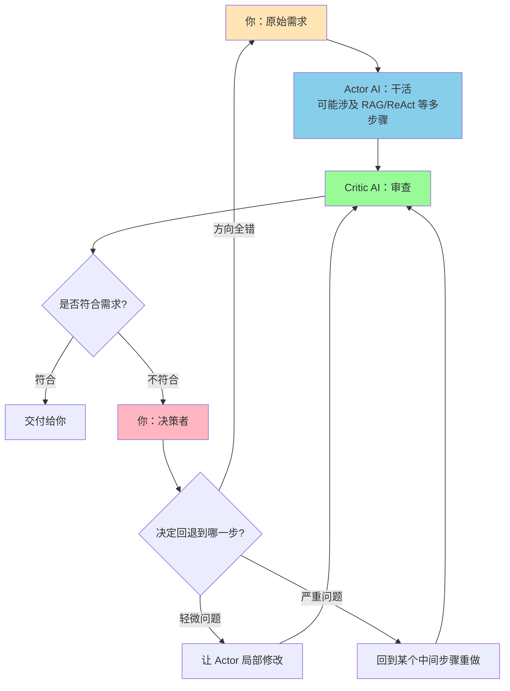

## 1. 会话概览 (Session Overview)

- 日期: 2026-01-16
- 时长: ~45 分钟
- 主要主题:
  - B.3 Reflection / Self-Correction（反思与自我修正模式）
  - Actor-Critic 架构设计
  - Human-in-the-Loop Supervisor 工作流

---

## 2. 核心交互记录 (Interaction Log)

### 主题 1: Reflection 模式的核心逻辑

#### 我的问题/场景 (My Question/Scenario)
- 在实际工作中，当 AI 生成的方案有问题时，我通常的做法是"再补充信息让它改"
- 想了解 Reflection（反思/自我审查）模式是如何工作的

#### 我的初始理解 (My Initial Understanding)
- [✓] 正确认为：需要有某种"检查清单"来验证输出是否符合要求
- [ ] 还没想清楚：Reflection 和我日常"补充信息让 AI 改"的做法有什么本质区别
- [ ] 还没想清楚：Self-Correction 和 Actor-Critic 的具体区别

#### 提供的解释 (Explanation Given)

**Reflection 的本质**：
- 传统做法：**人类当 Reviewer** — AI 出活 → 你看一眼 → 发现不对 → 补信息 → AI 再改
- Reflection 思路：**让 AI 自己当 Reviewer** — AI 生成初稿 → AI 自己审稿（问自己：这个回答解决用户问题了吗？有没有遗漏？有没有自相矛盾？）→ 如果发现问题 → 自己改 → 再审 → 直到通过

**类比**：
- 没有 Reflection = 实习生写完代码直接提交，等你来挑毛病
- 有 Reflection = 实习生写完先跑一遍 lint + 单元测试，自己改完再交给你

**我提出的三条检查清单**：
1. **是否回答了问题** = **目标对齐检查（Goal Alignment）**
2. **是否符合用户期望** = **约束满足检查（Constraint Satisfaction）**
3. **语言、格式有没有问题** = **表现层检查（Presentation Check）**

#### 理解检查 (Comprehension Checks)

- **问题(Q):** 如果用 Reflection 模式，Self-Correction 和 Actor-Critic 哪个更适合你的场景？
- **我的回答(A):** 我肯定不会在同一个对话里让他审查，起码得是两个独立对话框。
- **标记:** ✓ 正确
- **洞察:** 我的直觉"不信任同一模型的自我审查"正好对应了 Actor-Critic 模式的核心设计思路。
- **理解程度:** 良好

---

### 主题 2: Self-Correction vs Actor-Critic 两种实现方式

#### 我的问题/场景 (My Question/Scenario)
- 理解了 Reflection 的基本概念后，想知道具体有哪些实现方式，以及各自的优缺点

#### 我的初始理解 (My Initial Understanding)
- [✓] 正确认为：在同一个对话里自检不靠谱，容易"自我感觉良好"
- [✓] 正确认为：需要用"两个独立对话框"来保证审查的客观性
- [ ] 还没想清楚：在工具（如 Dify）里，虽然是两个节点，但共享同一份上下文，会不会影响独立性？

#### 提供的解释 (Explanation Given)

**方式 1：Self-Correction（自我修正）**
- 还是同一个 AI，先生成初稿，再用另一个 Prompt 让它"扮演审稿人"，检查自己写的东西
- 流程：`生成 → 自检 → 发现问题 → 重写 → 再自检 → 通过`
- 类比：就像你写完文档，自己读一遍，发现有错别字或逻辑不通的地方，自己改完再发出去

**方式 2：Actor-Critic（演员-评论家）**
- 用两个不同的 Agent：
  - **Actor（演员）**：负责生成内容
  - **Critic（评论家）**：专门负责挑刺，不生成内容，只打分和指出问题
- 流程：`Actor 生成 → Critic 审查 → 如果有问题 → Actor 根据 Critic 的反馈重写 → Critic 再审 → 通过`
- 类比：就像你写完文档，交给另一个同事帮你 Review，他指出问题后你再改

**为什么"同一个对话里自检"不靠谱**：
- 同一个对话里，AI 的"记忆"（Context）会带着"我刚才生成这个内容时的思路和偏见"
- 就像你自己写完一篇文档，立刻自己检查，很容易"自动脑补"那些你以为写了但其实没写的内容
- **Self-Correction（同一对话）** = 你写完立刻自己检查，容易"自我感觉良好"
- **Actor-Critic（两个独立对话）** = 你写完交给同事 Review，他没有你的"创作惯性"，更容易发现问题

#### 理解检查 (Comprehension Checks)

- **问题(Q):** 在 Dify 这种工具里，Actor 和 Critic 虽然是"两个不同的节点"，但它们还是在同一个工作流里，共享同一份上下文（State）。你觉得这种情况下，Critic 还能保持"独立审查"的客观性吗？
- **我的回答(A):** 不会的，虽然是共享同一个上下文，但是他们接收到的信息是不一样的。
- **标记:** ✓ 正确
- **洞察:** 抓住了 Actor-Critic 模式的设计关键：**信息隔离（Information Isolation）** — 关键在于控制 Critic 能看到什么、看不到什么。
- **理解程度:** 良好

---

### 主题 3: 信息隔离的三个层次

#### 我的问题/场景 (My Question/Scenario)
- 理解了"信息隔离"的重要性，想知道具体应该如何设计

#### 提供的解释 (Explanation Given)

**层次 1：只给结果，不给过程（最常见）**
- Actor 传给 Critic：只有"最终生成的文档/方案"
- Critic 看不到：Actor 的思考过程、中间草稿、尝试过的其他方案
- 类比：就像你把同事写的文档拿来 Review，你只看到最终版本，不知道他中间改了多少次

**层次 2：给结果 + 原始需求（更严格）**
- Actor 传给 Critic：用户的原始需求 + Actor 生成的最终输出
- Critic 的任务：对照原始需求，检查输出是否满足要求
- 类比：Code Review 时，你不仅要看代码写得对不对，还要对照"这个功能的需求文档"

**层次 3：给结果 + 检查清单（最精确）**
- Actor 传给 Critic：原始需求 + 最终输出 + **一份预先定义好的检查清单**
- Critic 的任务：按清单逐条检查，给出"通过 / 不通过 / 建议修改"
- 类比：就像代码提交前要过 CI/CD 流水线，每一项检查都是预先配置好的规则

---

### 主题 4: 增量修改 vs 从头重写的设计权衡

#### 我的问题/场景 (My Question/Scenario)
- 当 Critic 发现问题后，Actor 在重写时能不能看到自己的上一版？

#### 我的初始理解 (My Initial Understanding)
- [✓] 正确认为：如果还能看到之前的版本，还是会有创作惯性，跳不出自己上一次的思维框
- [ ] 还没想清楚：那是不是每次都应该"从头重写"？

#### 提供的解释 (Explanation Given)

**策略 A：允许看到上一版（增量修改）**
- 流程：`Actor 生成 v1 → Critic 反馈"问题是 XXX" → Actor 看着 v1 + 反馈，做局部修改 → 生成 v2`
- 优点：效率高、Token 消耗少
- 缺点：跳不出思维框、可能只是"打补丁"
- 适用场景：问题是局部的、细节性的（比如格式错误、某一段表述不清）

**策略 B：不允许看到上一版（从头重写）**
- 流程：`Actor 生成 v1 → Critic 反馈"问题是 XXX" → Actor 只看原始需求 + 反馈，从头重新生成 → 生成 v2`
- 优点：跳出思维框、避免累积错误
- 缺点：效率低、Token 消耗大、可能丢失 v1 里的亮点
- 适用场景：问题是方向性的、架构性的（比如整体思路不对、答非所问）

**现实中的混合策略**：
```
Critic 审查 → 判断问题类型
  ├─ 轻微问题（格式、用词） → 策略 A：增量修改
  └─ 严重问题（方向错误、答非所问） → 策略 B：从头重写
```

类比：
- 轻微问题 = Code Review 时发现变量命名不规范 → 改个名字就行
- 严重问题 = Code Review 时发现整个算法思路错了 → 删掉重写

---

### 主题 5: 我的 Human-in-the-Loop Reflection 工作流设计

#### 我的问题/场景 (My Question/Scenario)
- 如果要把我现在的工作方式"自动化"成一个 Agent 系统，应该怎么设计？

#### 我的设计思路 (My Design)

**我心目中的工作流**：
```
我给原始需求 
→ 大模型干活（可能中间涉及 RAG、ReAct 等多种小步骤）
→ 给到审查大模型（也可以是我）
→ 看是否符合我的原始需求
→ 不符合就打回去，或者给到我，让我决定从中间哪一步开始重做
```

**我的角色定位**：我是主管

#### 提供的解释 (Explanation Given)

**你的工作流 = Human-in-the-Loop Reflection（人在回路中的反思模式）**



**你的角色定位：Supervisor + 最终裁决者**
- 在 Agent 架构里，你的角色叫做 **"Human-in-the-Loop Supervisor"**（人在回路中的监督者）

**你的职责**：
1. 提供原始需求（Input）
2. 不参与具体执行（Actor AI 干活）
3. 不参与初审（Critic AI 先审一遍）
4. 只在关键决策点介入：
   - 当 Critic 说"不符合需求"时，你决定：
     - 是局部修改？
     - 还是回退到某个中间步骤？
     - 还是整个方向错了，从头来？

类比：就像公司里的项目经理，不亲自写代码，不亲自做 Code Review，但在"要不要砍掉这个功能重做"这种大决策上，必须你拍板。

---

### 主题 6: "一眼看出不对"的感觉如何结构化

#### 我的问题/场景 (My Question/Scenario)
- 在实际工作中，我经常"一眼就能看出 AI 的方案不对"，但这更多是一种"感觉"，很难具体化

#### 我的初始理解 (My Initial Understanding)
- [✓] 正确认为：这个"感觉"比较难具象化
- [✓] 正确认为：但我知道是可以（部分）结构化的

#### 提供的解释 (Explanation Given)

**层次 1：可以结构化的检查（Hard Rules）**
- 这部分是可以翻译成 Critic 检查清单的：
  - **目标对齐**：回答了我的问题吗？还是答非所问？
  - **完整性**：我要求的几个关键点都覆盖了吗？
  - **约束满足**：我说的"不要太长"、"要有具体案例"这些限制条件，都做到了吗？
  - **逻辑自洽**：前后有没有矛盾的地方？

**层次 2：难以结构化的"产品直觉"（Soft Judgment）**
- 这部分是你作为 PM 的经验和直觉，很难让 AI 完全替代：
  - **这个方案看起来"不够稳"**（虽然说不出具体哪里不对）
  - **这个表述"感觉不专业"**（但符合所有硬性规则）
  - **这个设计"用户不会买账"**（需要对用户心理的深度理解）
- 这部分需要对业务的深度理解、对用户的同理心、多年踩坑的经验
- **这就是为什么你的工作流里，最终还是要"给到我，让我决定"**

---

### 主题 7: Critic 判断"方向正确性"时的常见问题

#### 我的问题/场景 (My Question/Scenario)
- 假设 Critic AI 每次都能准确指出"格式问题"和"逻辑漏洞"，但对于"方向是否正确"的判断经常出错（要么太严、要么太松），问题可能出在哪里？

#### 我的回答 (My Answer)
- 如果是方向性的问题，那么我会认为他接收到的信息是有问题的，要么原始信息要么 State 有问题

#### 提供的解释 (Explanation Given)

**Critic 判断"方向正确性"需要的三个关键信息**：

**1. 用户的原始需求（必须有）**
- 这是最基础的，Critic 要对照"用户到底想要什么"来判断 Actor 的输出

**2. 用户的隐含意图和约束（常常缺失）**
- 你说的"原始信息有问题"，往往就是这一层出问题
- 比如：
  - 用户说"帮我优化这个流程"，但没说"优化的目标是降低成本还是提升体验"
  - 用户说"写一份需求文档"，但没说"这份文档是给开发看还是给老板汇报用"
- **如果 Critic 只看到"优化流程"这四个字，他怎么判断 Actor 优化的方向对不对？**

**3. 业务背景和领域知识（最难获取）**
- 这是你说的"State 有问题"的部分
- 比如用户说"帮我设计一个用户激励体系"，Actor 设计了一套积分+等级系统
- Critic 要判断"这个方向对不对"，他需要知道：
  - 这个产品的目标用户是谁？（to B 还是 to C？）
  - 现有的用户行为数据是什么样的？
  - 竞品都在用什么激励手段？
- **如果 Critic 不知道这些背景，他只能靠"通用常识"来判断，自然容易出错**

**解决方案：Rich Context for Critic（给 Critic 更丰富的上下文）**

**方案 1：在原始需求阶段就补全信息**
- 在用户提需求时，通过追问澄清：你的核心目标是什么？有哪些约束条件？使用场景是什么？
- 把这些信息写入 State，传给 Actor 和 Critic

**方案 2：让 Critic 能访问外部知识库（RAG）**
- Critic 在审查时，可以查询：历史需求的处理方式、领域最佳实践、用户画像数据

**方案 3：让 Critic 先问问题，再审查**
- Critic 在看到 Actor 的输出后，先问自己："要判断这个方向对不对，我需要知道什么信息？这些信息我现在有吗？"
- 如果缺关键信息，Critic 返回"需要补充 XXX 信息才能审查"

#### 理解检查 (Comprehension Checks)

- **问题(Q):** Critic 在判断"方向正确性"时经常出错，你觉得问题可能出在哪里？
- **我的回答(A):** 如果是方向性的问题，那么我会认为他接收到的信息是有问题的，要么原始信息要么 State 有问题。
- **标记:** ✓ 正确
- **洞察:** 准确诊断了 Reflection 失效的核心原因 — 不是 Critic 不够聪明，而是 Critic 拿到的信息不够完整。方向指向了 Reflection 模式的核心优化方向：**Rich Context for Critic**。
- **理解程度:** 优秀

---

## 3. 识别出的知识盲区与下次行动项

### 知识盲区表

| 主题 | 严重程度 | 备注 | 解决状态 |
|------|--------|------|--------|
| Reflection + RAG 的组合用法 | 中 | 已理解 Reflection 和 RAG 的单独概念，但还没深入探讨如何在同一个工作流里组合使用（Actor 干活时调用 RAG，Critic 审查时也能查询知识库） | 未解决 |
| ReAct、Planner、Reflection 三个模式的区别与组合用法 | 中 | 三个模式都单独学过，但还没有横向对比过它们的适用场景、优缺点、以及如何在一个复杂的 Agent 系统里组合使用 | 未解决 |
| Critic 检查清单的设计方法论 | 低 | 能说出 3 条基础检查项，但还不清楚如何系统性地设计一套完整的检查清单（针对不同类型的任务） | 未解决 |
| Human-in-the-Loop 决策点的设计原则 | 低 | 知道自己在工作流里的角色是"最终裁决者"，但还不清楚在什么情况下应该让人类介入、什么情况下应该让 AI 自动处理 | 未解决 |

### 🎯 针对上述盲区的下次行动项

- [ ] **深挖 Reflection + RAG 组合**:
  - 探讨 Actor 在生成时如何调用 RAG
  - 探讨 Critic 在审查时如何查询知识库来补充背景信息
  - 设计一个完整的 Reflection + RAG 工作流

- [ ] **横向对比 ReAct / Planner / Reflection 三大模式**:
  - 整理它们的核心机制、适用场景、优缺点
  - 设计一个"混合模式"的 Agent 系统（什么时候用哪个模式）
  - 画出一张完整的决策树或流程图

- [ ] **学习 B.4 Tool Use（工具调用）**:
  - 继续推进核心编排模式的学习
  - 理解工具调用的容错处理机制

### 📋 行动项-盲区映射

| 行动项 | 对应盲区 | 优先级 |
|--------|--------|--------|
| 深挖 Reflection + RAG 组合 | Reflection + RAG 的组合用法 | 中 |
| 横向对比三大模式 | ReAct、Planner、Reflection 的区别与组合 | 高 |
| 学习 B.4 Tool Use | 推进核心编排模式学习 | 高 |

---

## 4. 本次掌握的主题总结 (Topics Mastered Today)

| 主题 | 信心指数 | 备注 | 来源 |
|------|--------|------|------|
| B.3 Reflection / Self-Correction 核心逻辑 | 良好 | 理解了 Reflection 的本质是"让 AI 自己当 Reviewer"，能区分 Self-Correction 和 Actor-Critic 两种实现方式，明确了信息隔离的重要性 | 主题 1-2 理解检查 |
| Actor-Critic 架构的信息隔离设计 | 良好 | 理解了"虽然共享同一个上下文，但接收到的信息是不一样的"这一核心设计思路，掌握了信息隔离的三个层次 | 主题 2-3 理解检查 |
| 增量修改 vs 从头重写的设计权衡 | 良好 | 理解了"避免创作惯性"的重要性，能根据问题严重程度选择不同的重写策略（局部修改 vs 从头重写） | 主题 4 理解检查 |
| Human-in-the-Loop Reflection 工作流设计 | 良好 | 能清晰描述自己期望的工作流（原始需求 → Actor 执行 → Critic 审查 → 人类决策），明确了自己在系统中的角色定位（Supervisor + 最终裁决者） | 主题 5 理解检查 |
| Critic 判断"方向正确性"的关键因素 | 优秀 | 准确诊断了 Critic 失效的核心原因（信息不完整），提出了"要么原始信息要么 State 有问题"的关键洞察，理解了 Rich Context for Critic 的重要性 | 主题 7 理解检查 |
